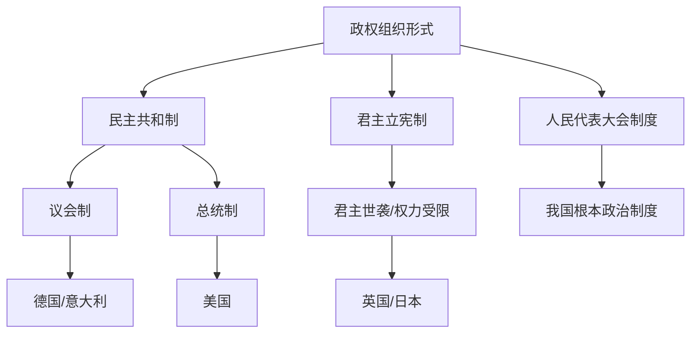

# 第一课 国体与政体：国家的政权组织形式

## 核心概念

**政权组织形式（政体）**：国家政权的组织形式，即统治阶级采取何种形式组织自己的政权机关。

**民主共和制**：国家权力机关和国家元首由**选举**产生并有一定任期的政体，分为**议会制**和**总统制**。

**君主立宪制**：国家元首由**世袭**的君主担任，君主权力受宪法和法律限制的政体。

**人民代表大会制度**：我国的根本政治制度，是我国的政权组织形式。

## 知识梳理

| 政体类型 | 国家元首产生 | 典型国家 |
| --- | --- | --- |
| 议会制共和制 | 选举产生 | 德国、意大利 |
| 总统制共和制 | 选举产生 | 美国 |
| 君主立宪制 | 世袭 | 英国、日本 |
| 人民代表大会制 | 选举产生 | 中国 |

## 原理与方法论

**原理**：政体由国体决定，并受历史传统、文化、国情等因素影响，具有多样性。

**方法论**：比较不同政体时，要结合各国国情分析；坚持和完善人民代表大会制度，坚定制度自信。

## 典型题例

**例**：为什么说人民代表大会制度是我国的根本政治制度？

**解**：人民代表大会制度直接体现我国人民民主专政的国体，是人民当家作主的根本途径和最高实现形式，是我国的政权组织形式，因此是根本政治制度。

## 易错点

- 民主共和制国家元首由**选举**产生；君主立宪制由**世袭**产生。
- 议会制与总统制的区别在于**政府与议会的关系**。
- 人民代表大会制度是我国的**根本政治制度**，不是基本政治制度。
- 政体具有多样性，受国情影响。

## 背记要点

1. 政体类型：民主共和制、君主立宪制、人民代表大会制度。
2. 民主共和制分议会制和总统制。
3. 人民代表大会制度是我国的根本政治制度。
4. 政体由国体决定，受国情影响。

## 自测题

1. 民主共和制国家元首由____产生。
2. 君主立宪制国家元首由____产生。
3. 我国的政权组织形式是____。
4. 美国实行____制。

## 相关知识点

国家本质见 [[第一课 国体与政体：国家是什么]]；政党和利益集团见 [[第一课 国体与政体：政党和利益集团]]。
