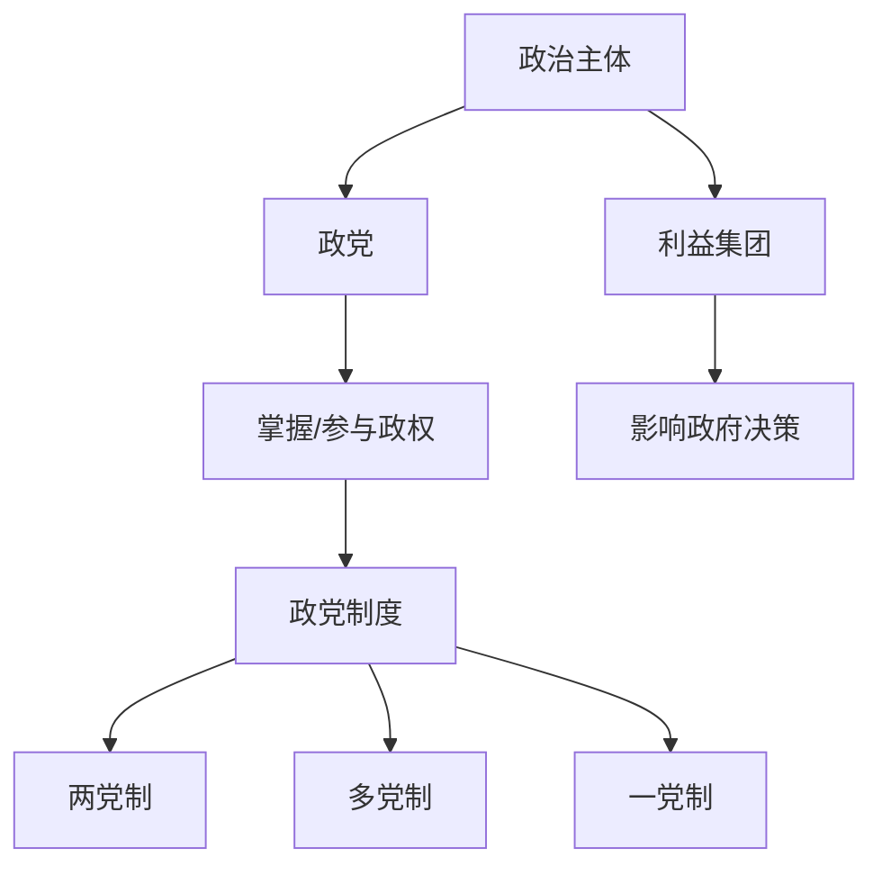

# 第一课 国体与政体：政党和利益集团

## 核心概念

**政党**：代表一定阶级、阶层或集团的利益，以掌握国家政权、参与国家政治生活为目标的政治组织。

**政党的特征**：具有**阶级性**、**政治纲领**、**组织纪律性**，以夺取或参与政权为目标。

**政党制度**：国家中政党执政、参政的方式，如两党制、多党制、一党制。

**利益集团**：具有共同利益的人组成的、通过影响政府决策来维护自身利益的社会团体。

## 知识梳理

| 概念 | 目标 | 特点 |
| --- | --- | --- |
| 政党 | 掌握或参与政权 | 阶级性、有纲领 |
| 利益集团 | 影响政府决策 | 维护特定利益 |
| 政党制度 | 规范政党活动 | 两党制、多党制等 |

## 原理与方法论

**原理**：政党是阶级的组织，具有鲜明的阶级性；利益集团通过影响决策维护特定利益。

**方法论**：分析政党制度要把握其阶级本质；认识利益集团在西方政治中的作用，坚持我国的多党合作和政治协商制度。

## 典型题例

**例**：政党与利益集团有何区别？

**解**：政党的目标是**掌握或参与国家政权**，具有阶级性和政治纲领；利益集团的目标是**影响政府决策**以维护特定利益，不直接谋求执政。

## 易错点

- 政党的目标是**掌握或参与政权**，利益集团是**影响决策**。
- 政党具有**阶级性**，是阶级的组织。
- 我国实行**中国共产党领导的多党合作和政治协商制度**。
- 利益集团不等于政党。

## 背记要点

1. 政党：掌握/参与政权，有阶级性、纲领。
2. 利益集团：影响决策，维护特定利益。
3. 政党制度：两党制、多党制、一党制。
4. 我国：多党合作和政治协商制度。

## 自测题

1. 政党的目标是____。
2. 利益集团的目标是____。
3. 政党具有____性。
4. 我国实行____制度。

## 相关知识点

国家本质见 [[第一课 国体与政体：国家是什么]]；政权组织形式见 [[第一课 国体与政体：国家的政权组织形式]]。
