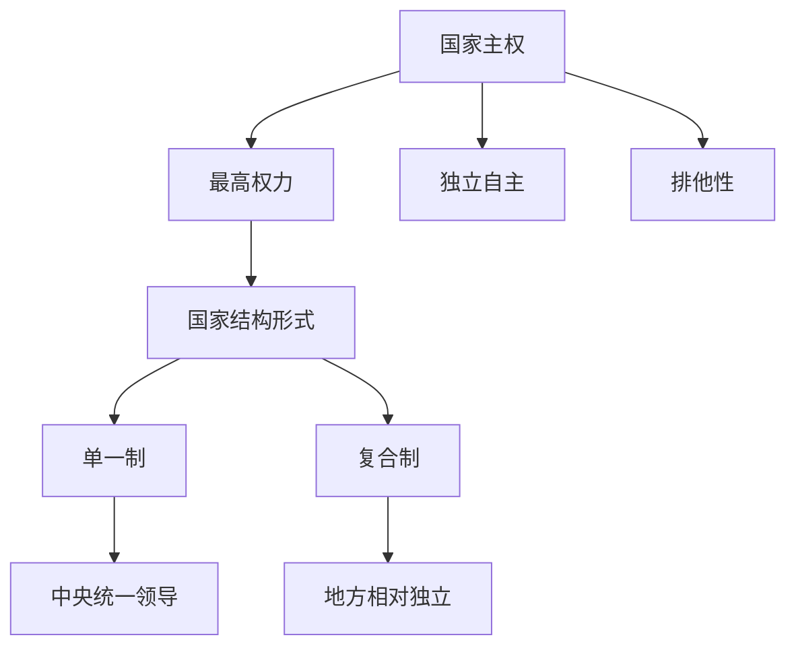

# 第二课 国家的结构形式：主权统一与政权分层

## 核心概念

**国家主权**：国家最重要的构成要素，指国家对其领土、人民和事务拥有的**最高权力**，具有**独立自主性**和**排他性**。

**国家结构形式**：国家整体与部分、中央与地方之间的关系，分为**单一制**和**复合制**。

**政权分层**：国家在中央与地方之间划分权力，中央统一领导，地方在中央统一领导下行使职权。

## 知识梳理

| 概念 | 含义 | 特点 |
| --- | --- | --- |
| 国家主权 | 国家最高权力 | 独立自主、排他 |
| 国家结构形式 | 中央与地方关系 | 单一制/复合制 |
| 政权分层 | 中央与地方分权 | 中央统一领导 |

## 原理与方法论

**原理**：国家主权是国家的生命和灵魂，是国家最重要的构成要素；国家结构形式反映中央与地方的关系。

**方法论**：坚持国家主权统一，维护国家统一和领土完整；正确认识中央与地方的关系，坚持中央统一领导。

## 典型题例

**例**：为什么说国家主权是国家的生命和灵魂？

**解**：主权是国家对其领土、人民和事务拥有的最高权力，具有独立自主性和排他性。没有主权，国家就不能独立自主地处理内外事务，因此主权是国家的生命和灵魂。

## 易错点

- 主权是国家的**生命和灵魂**，是最重要的构成要素。
- 主权具有**独立自主性**和**排他性**。
- 国家结构形式是**中央与地方**的关系，不是政权组织形式。
- 我国是**单一制**国家，坚持中央统一领导。

## 背记要点

1. 主权：最高权力，独立自主、排他。
2. 国家结构形式：单一制、复合制。
3. 政权分层：中央统一领导，地方行使职权。
4. 我国是单一制国家。

## 自测题

1. 国家最重要的构成要素是____。
2. 主权具有____性和____性。
3. 国家结构形式分为____和____。
4. 我国是____制国家。

## 相关知识点

单一制和复合制见 [[第二课 国家的结构形式：单一制和复合制]]；国家安全见 [[综合探究 国家安全与核心利益]]。
