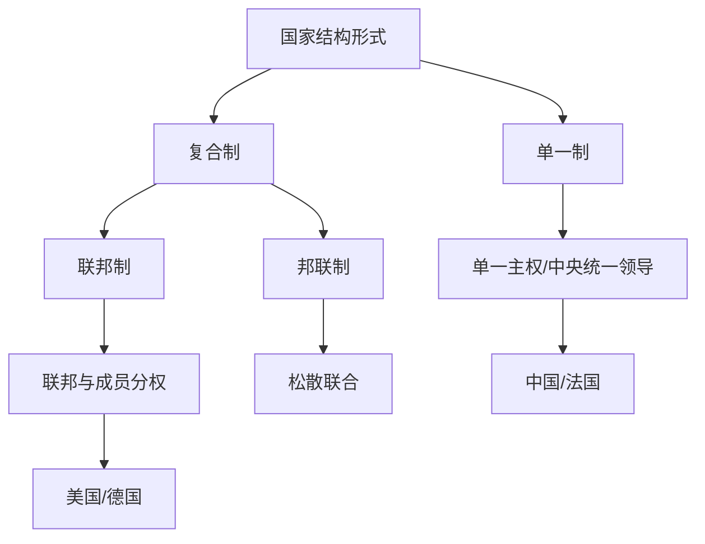

# 第二课 国家的结构形式：单一制和复合制

## 核心概念

**单一制**：由若干行政区域构成的**单一主权国家**，全国只有一个中央政权，地方在中央统一领导下行使职权。

**复合制**：由若干成员单位（州、邦、共和国等）联合组成的国家，分为**联邦制**和**邦联制**。

**联邦制**：由若干成员单位组成的国家，联邦与成员单位各有宪法和政权机关，在各自权限范围内行使职权。

## 知识梳理

| 结构形式 | 特点 | 典型国家 |
| --- | --- | --- |
| 单一制 | 单一主权、中央统一领导 | 中国、法国 |
| 联邦制 | 联邦与成员分权 | 美国、德国 |
| 邦联制 | 松散联合 | 较少见 |

## 原理与方法论

**原理**：单一制与复合制是两种不同的国家结构形式，其区别在于中央与地方（成员单位）的权力划分。

**方法论**：比较不同国家结构形式，理解我国单一制国家的优越性，坚持中央统一领导，维护国家统一。

## 典型题例

**例**：单一制与联邦制的主要区别是什么？

**解**：单一制国家只有一个中央政权，地方在中央统一领导下行使职权；联邦制国家联邦与成员单位各有宪法和政权机关，在各自权限范围内行使职权，成员单位具有较大自主权。

## 易错点

- 单一制是**单一主权**国家，联邦制是**复合主权**（联邦与成员分权）。
- 我国是**单一制**国家，不是联邦制。
- 邦联制是**松散联合**，不是真正意义上的国家。
- 单一制与复合制的区别在于**中央与地方权力划分**。

## 背记要点

1. 单一制：单一主权、中央统一领导。
2. 复合制：联邦制、邦联制。
3. 联邦制：联邦与成员分权。
4. 我国是单一制国家。

## 自测题

1. 单一制国家只有____个中央政权。
2. 联邦制国家____与____各有宪法。
3. 我国是____制国家。
4. 美国实行____制。

## 相关知识点

主权统一见 [[第二课 国家的结构形式：主权统一与政权分层]]；国家安全见 [[综合探究 国家安全与核心利益]]。
