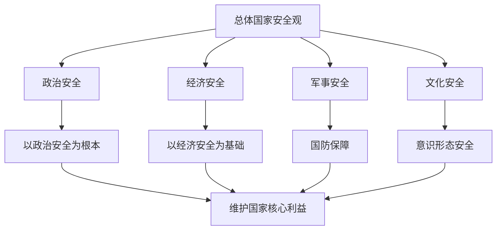

# 综合探究 国家安全与核心利益

## 核心概念

**国家安全**：国家政权、主权、统一和领土完整、人民福祉、经济社会可持续发展和国家其他重大利益相对处于没有危险和不受内外威胁的状态。

**国家核心利益**：国家主权、国家安全、领土完整、国家统一、国家发展等根本利益。

**总体国家安全观**：以人民安全为宗旨，以政治安全为根本，以经济安全为基础，统筹发展和安全。

## 知识梳理

| 安全领域 | 内容 | 意义 |
| --- | --- | --- |
| 政治安全 | 政权、制度安全 | 根本 |
| 经济安全 | 经济稳定发展 | 基础 |
| 军事安全 | 国防力量 | 保障 |
| 文化安全 | 意识形态安全 | 重要 |

## 原理与方法论

**原理**：国家安全是国家生存发展的基本前提，维护国家安全是每个公民的义务。

**方法论**：坚持总体国家安全观，统筹发展和安全；增强国家安全意识，自觉维护国家主权、安全和发展利益。

## 典型题例

**例**：为什么说国家安全是安邦定国的重要基石？

**解**：国家安全是国家政权、主权、统一和领土完整、人民福祉等处于安全状态，是国家生存发展的基本前提。没有国家安全，就没有国家的发展和人民的幸福，因此是安邦定国的重要基石。

## 易错点

- 总体国家安全观以**人民安全为宗旨**，以**政治安全为根本**，以**经济安全为基础**。
- 国家安全包括政治、经济、军事、文化等多领域。
- 维护国家安全是**每个公民的义务**。
- 国家核心利益包括主权、安全、领土完整、统一、发展。

## 背记要点

1. 总体国家安全观：人民安全为宗旨、政治安全为根本、经济安全为基础。
2. 国家安全是安邦定国的重要基石。
3. 国家核心利益：主权、安全、领土完整、统一、发展。
4. 维护国家安全是公民义务。

## 自测题

1. 总体国家安全观以____为宗旨。
2. 以____为根本，以____为基础。
3. 国家安全是____的重要基石。
4. 维护国家安全是____的义务。

## 相关知识点

主权统一见 [[第二课 国家的结构形式：主权统一与政权分层]]；中国外交见 [[第五课 中国的外交：中国外交政策的形成与发展]]。
