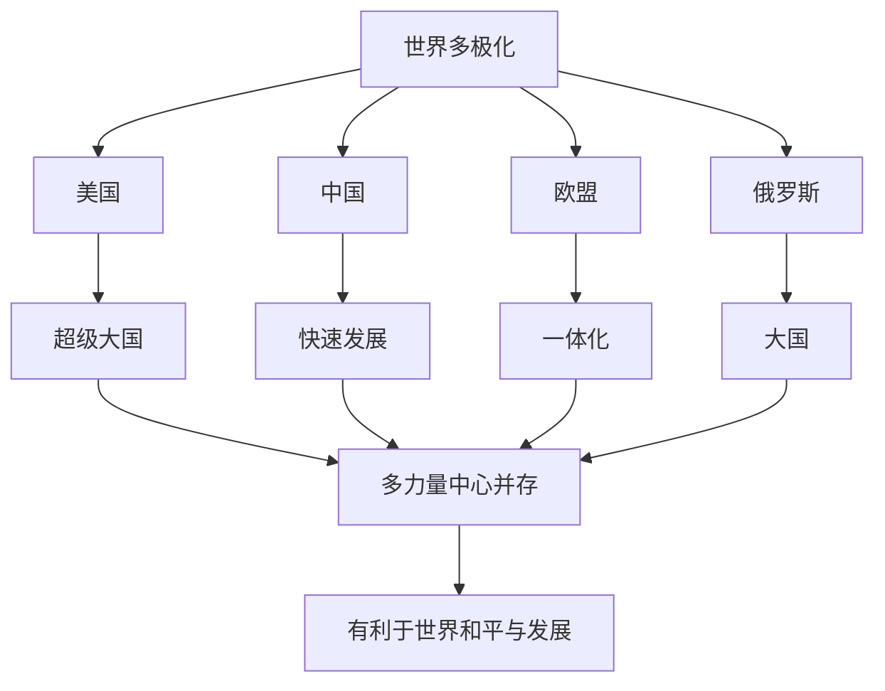

# 第三课 多极化趋势：世界多极化的发展

## 核心概念

**世界多极化**：世界格局中多个力量中心并存、相互制约、相互影响的趋势，是当今国际形势的一个突出特点。

**多极化的表现**：美国、欧盟、中国、俄罗斯、日本等力量中心的发展，发展中国家群体性崛起。

**多极化的意义**：有利于世界和平与发展，有利于反对霸权主义和强权政治，推动国际关系民主化。

## 知识梳理

| 力量中心 | 特点 | 作用 |
| --- | --- | --- |
| 美国 | 超级大国 | 单极倾向 |
| 中国 | 快速发展 | 重要一极 |
| 欧盟 | 一体化 | 重要力量 |
| 俄罗斯 | 大国 | 重要一极 |

## 原理与方法论

**原理**：世界多极化是当今国际形势的突出特点，多种力量中心相互制约，有利于世界和平与发展。

**方法论**：正确认识多极化趋势，反对霸权主义和强权政治，推动国际关系民主化，维护世界和平。

## 典型题例

**例**：为什么说世界多极化有利于世界和平与发展？

**解**：多极化使多个力量中心相互制约，有利于抑制霸权主义和强权政治，推动国际关系民主化，为世界和平与发展创造了有利条件。

## 易错点

- 多极化是**趋势**，不是已经形成的格局。
- 多极化有利于**反对霸权主义**和**强权政治**。
- 发展中国家**群体性崛起**是多极化的重要表现。
- 多极化推动**国际关系民主化**。

## 背记要点

1. 多极化：多个力量中心并存、相互制约。
2. 力量中心：美国、中国、欧盟、俄罗斯等。
3. 意义：有利于和平与发展、反对霸权主义。
4. 多极化是趋势，推动国际关系民主化。

## 自测题

1. 世界多极化是当今国际形势的____。
2. 多极化有利于____和____。
3. 多极化推动____。
4. 发展中国家____是多极化的重要表现。

## 相关知识点

国际关系见 [[第三课 多极化趋势：国际关系]]；和平与发展见 [[第四课 和平与发展：时代的主题]]。
