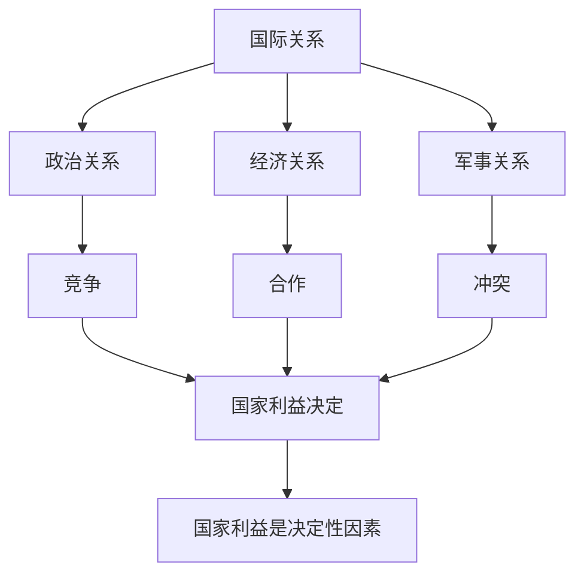

# 第三课 多极化趋势：国际关系

## 核心概念

**国际关系**：国家之间、国际组织之间以及国家与国际组织之间的关系，最主要的是**国家与国家**之间的关系。

**国际关系的内容**：政治关系、经济关系、文化关系、军事关系等。

**国际关系的基本形式**：**竞争、合作、冲突**。

**国家利益**：国家生存与发展的需要，是国际关系的**决定性因素**。

## 知识梳理

| 内容 | 形式 | 决定因素 |
| --- | --- | --- |
| 政治关系 | 竞争 | 国家利益 |
| 经济关系 | 合作 | 国家利益 |
| 军事关系 | 冲突 | 国家利益 |

## 原理与方法论

**原理**：国家利益是国际关系的决定性因素，国家间既合作又竞争，共同利益是合作的基础，利益对立是冲突的根源。

**方法论**：维护国家利益是主权国家对外活动的出发点和落脚点；在维护自身利益的同时，尊重他国正当利益，寻求共同利益。

## 典型题例

**例**：为什么说国家利益是国际关系的决定性因素？

**解**：国家利益是国家生存与发展的需要，各国都从自身国家利益出发处理国际关系。共同利益是国家合作的基础，利益对立是冲突的根源，因此国家利益是国际关系的决定性因素。

## 易错点

- 国际关系最主要的是**国家与国家**之间的关系。
- 国际关系的基本形式是**竞争、合作、冲突**。
- 国家利益是国际关系的**决定性因素**。
- 共同利益是合作的基础，利益对立是冲突的根源。

## 背记要点

1. 国际关系内容：政治、经济、文化、军事。
2. 基本形式：竞争、合作、冲突。
3. 国家利益是决定性因素。
4. 共同利益—合作基础；利益对立—冲突根源。

## 自测题

1. 国际关系最主要的是____之间的关系。
2. 国际关系的基本形式是____、____、____。
3. 国际关系的决定性因素是____。
4. 国家合作的基础是____。

## 相关知识点

多极化见 [[第三课 多极化趋势：世界多极化的发展]]；和平与发展见 [[第四课 和平与发展：时代的主题]]。
