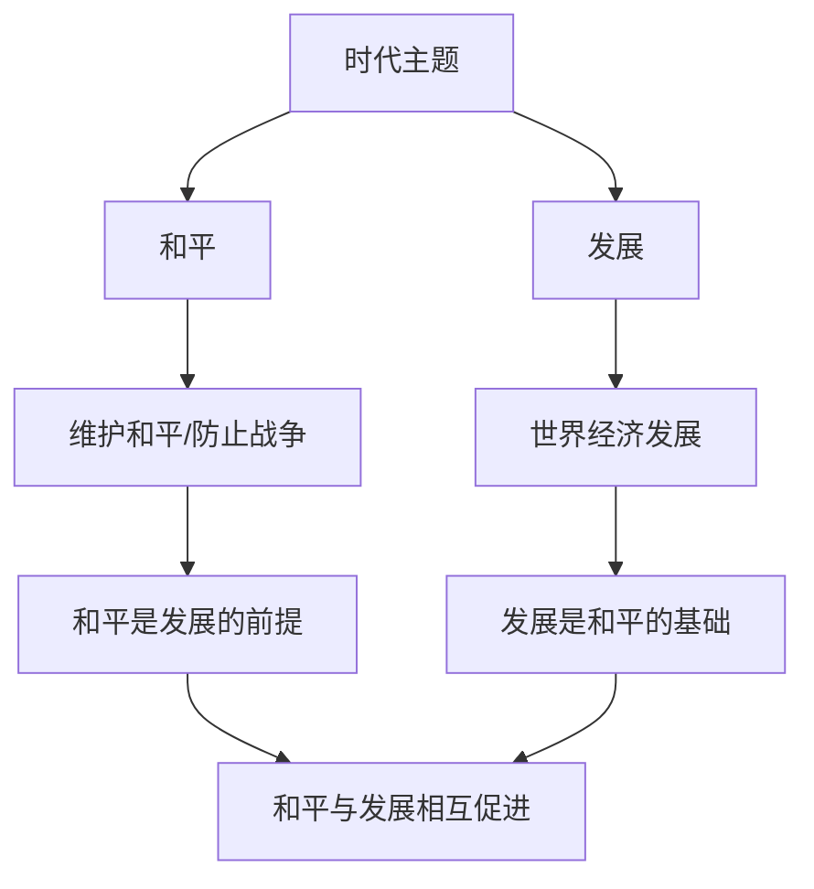

# 第四课 和平与发展：时代的主题

## 核心概念

**和平问题**：维护世界和平、防止新的世界战争的问题。

**发展问题**：世界经济发展，特别是发展中国家经济发展的问题。

**和平与发展的关系**：和平是发展的**前提**，发展是和平的**基础**。

**时代主题**：当今时代的主题是**和平与发展**。

## 知识梳理

| 概念 | 含义 | 关系 |
| --- | --- | --- |
| 和平问题 | 维护和平、防止战争 | 发展的前提 |
| 发展问题 | 世界经济发展 | 和平的基础 |
| 时代主题 | 和平与发展 | 相互促进 |

## 原理与方法论

**原理**：和平与发展是当今时代的主题，和平是发展的前提，发展是和平的基础。

**方法论**：坚持和平发展道路，反对霸权主义和强权政治；推动共同发展，促进世界和平。

## 典型题例

**例**：为什么说和平是发展的前提？

**解**：只有在和平的国际环境中，各国才能集中精力发展经济、改善民生。战争和冲突会破坏发展环境、消耗资源，因此和平是发展的前提。

## 易错点

- 时代主题是**和平与发展**，不是"和平与战争"。
- 和平是发展的**前提**，发展是和平的**基础**。
- 和平问题与发展问题相互联系、相互促进。
- 霸权主义和强权政治是和平与发展的主要障碍。

## 背记要点

1. 时代主题：和平与发展。
2. 和平是发展的前提，发展是和平的基础。
3. 和平问题—维护和平；发展问题—世界经济发展。
4. 霸权主义、强权政治是主要障碍。

## 自测题

1. 当今时代的主题是____。
2. 和平是发展的____，发展是和平的____。
3. 和平问题是指____。
4. 和平与发展的主要障碍是____。

## 相关知识点

挑战与应对见 [[第四课 和平与发展：挑战与应对]]；中国外交见 [[第五课 中国的外交：中国外交政策的形成与发展]]。
