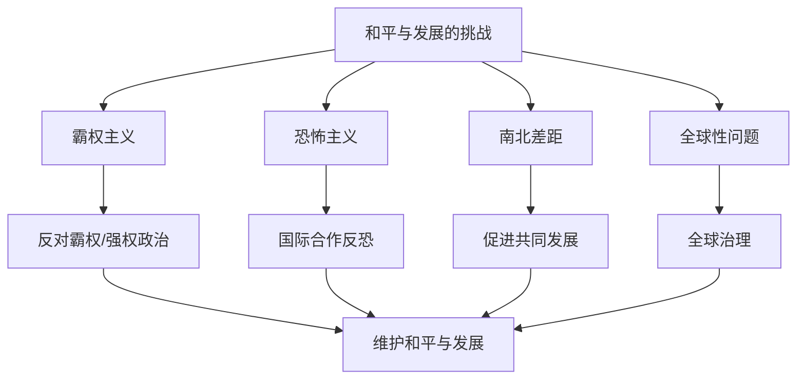

# 第四课 和平与发展：挑战与应对

## 核心概念

**和平与发展的主要障碍**：**霸权主义和强权政治**是威胁世界和平与发展的主要障碍。

**和平与发展的挑战**：地区冲突、恐怖主义、南北差距、全球性问题（气候变化、疫情）等。

**应对措施**：反对霸权主义和强权政治，推动国际关系民主化，加强国际合作，促进共同发展。

## 知识梳理

| 挑战 | 表现 | 应对 |
| --- | --- | --- |
| 霸权主义 | 干涉别国内政 | 反对霸权 |
| 恐怖主义 | 恐怖袭击 | 国际合作反恐 |
| 南北差距 | 贫富分化 | 促进共同发展 |
| 全球性问题 | 气候变化 | 全球治理 |

## 原理与方法论

**原理**：霸权主义和强权政治是威胁世界和平与发展的主要障碍，和平与发展面临诸多挑战。

**方法论**：坚决反对霸权主义和强权政治，推动国际关系民主化；加强国际合作，共同应对全球性挑战。

## 典型题例

**例**：为什么说霸权主义和强权政治是和平与发展的主要障碍？

**解**：霸权主义和强权政治干涉别国内政、破坏国际秩序，引发冲突和动荡，阻碍世界经济发展，因此是威胁世界和平与发展的主要障碍。

## 易错点

- 和平与发展的**主要障碍**是霸权主义和强权政治。
- 恐怖主义、南北差距、全球性问题也是重要挑战。
- 应对需**国际合作**和**国际关系民主化**。
- 全球性问题需**全球治理**。

## 背记要点

1. 主要障碍：霸权主义和强权政治。
2. 挑战：恐怖主义、南北差距、全球性问题。
3. 应对：反对霸权、国际合作、共同发展。
4. 全球性问题需全球治理。

## 自测题

1. 和平与发展的主要障碍是____。
2. 恐怖主义需____应对。
3. 南北差距指____。
4. 全球性问题需____。

## 相关知识点

时代主题见 [[第四课 和平与发展：时代的主题]]；人类命运共同体见 [[第五课 中国的外交：构建人类命运共同体]]。
