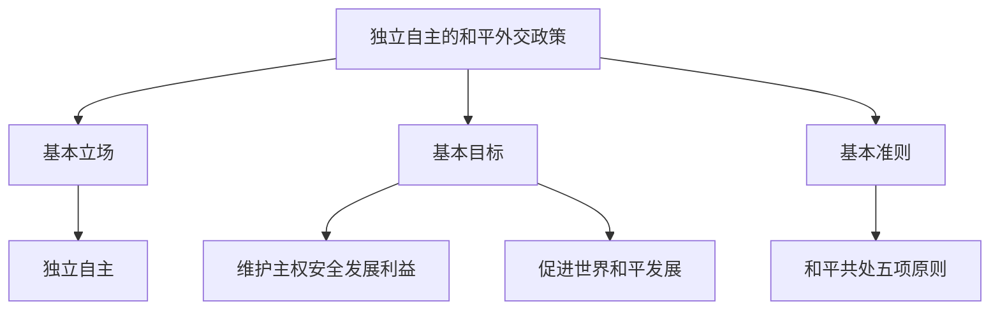

# 第五课 中国的外交：中国外交政策的形成与发展

## 核心概念

**外交政策**：主权国家对外活动的目标、原则和方式的总和。

**我国的外交政策**：**独立自主的和平外交政策**。

**我国外交政策的基本内容**：基本立场是**独立自主**；基本目标是维护我国的主权、安全和发展利益，促进世界的和平与发展；基本准则是**和平共处五项原则**。

## 知识梳理

| 内容 | 具体表述 |
| --- | --- |
| 基本立场 | 独立自主 |
| 基本目标 | 维护主权安全发展利益、促进世界和平发展 |
| 基本准则 | 和平共处五项原则 |
| 基本宗旨 | 维护世界和平、促进共同发展 |

## 原理与方法论

**原理**：我国奉行独立自主的和平外交政策，坚持和平发展道路，推动构建人类命运共同体。

**方法论**：坚持独立自主，维护国家主权、安全和发展利益；坚持和平共处五项原则，促进世界和平与发展。

## 典型题例

**例**：我国外交政策的基本立场是什么？

**解**：我国外交政策的基本立场是**独立自主**，即坚持从我国人民和世界人民的根本利益出发，独立自主地处理国际事务，不屈服于任何外来压力。

## 易错点

- 我国外交政策是**独立自主的和平外交政策**。
- 基本立场是**独立自主**，基本准则是**和平共处五项原则**。
- 基本目标是维护主权安全发展利益、促进世界和平发展。
- 和平共处五项原则包括互相尊重主权和领土完整、互不侵犯、互不干涉内政、平等互利、和平共处。

## 背记要点

1. 外交政策：独立自主的和平外交政策。
2. 基本立场：独立自主。
3. 基本准则：和平共处五项原则。
4. 基本目标：维护主权安全发展利益、促进世界和平发展。

## 自测题

1. 我国的外交政策是____。
2. 我国外交政策的基本立场是____。
3. 我国外交政策的基本准则是____。
4. 和平共处五项原则包括____。

## 相关知识点

人类命运共同体见 [[第五课 中国的外交：构建人类命运共同体]]；中国智慧见 [[综合探究 贡献中国智慧]]。
