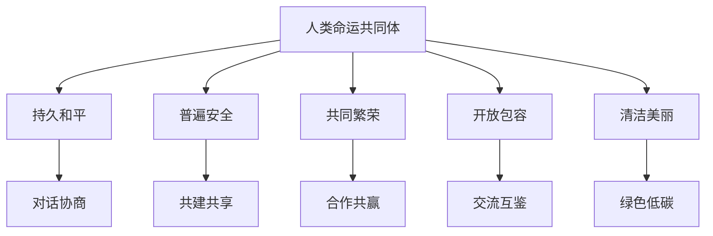

# 第五课 中国的外交：构建人类命运共同体

## 核心概念

**人类命运共同体**：各国人民同心协力，建设持久和平、普遍安全、共同繁荣、开放包容、清洁美丽的世界。

**人类命运共同体的内涵**：坚持对话协商、共建共享、合作共赢、交流互鉴、绿色低碳。

**构建人类命运共同体的意义**：为世界和平与发展贡献中国智慧和中国方案，推动全球治理体系变革。

## 知识梳理

| 内涵 | 内容 |
| --- | --- |
| 持久和平 | 对话协商 |
| 普遍安全 | 共建共享 |
| 共同繁荣 | 合作共赢 |
| 开放包容 | 交流互鉴 |
| 清洁美丽 | 绿色低碳 |

## 原理与方法论

**原理**：构建人类命运共同体是习近平外交思想的重要内容，为世界和平与发展贡献中国智慧。

**方法论**：坚持合作共赢，推动构建人类命运共同体；积极参与全球治理，为世界发展作出中国贡献。

## 典型题例

**例**：构建人类命运共同体的内涵有哪些？

**解**：建设持久和平、普遍安全、共同繁荣、开放包容、清洁美丽的世界，分别对应对话协商、共建共享、合作共赢、交流互鉴、绿色低碳。

## 易错点

- 人类命运共同体强调**合作共赢、共建共享**。
- 内涵五方面：和平、安全、繁荣、包容、美丽。
- 是中国为世界贡献的**中国智慧和中国方案**。
- 推动**全球治理体系变革**。

## 背记要点

1. 人类命运共同体：持久和平、普遍安全、共同繁荣、开放包容、清洁美丽。
2. 对应：对话协商、共建共享、合作共赢、交流互鉴、绿色低碳。
3. 是中国智慧和中国方案。
4. 推动全球治理体系变革。

## 自测题

1. 人类命运共同体建设____、____、____的世界。
2. 持久和平对应____。
3. 共同繁荣对应____。
4. 人类命运共同体是中国贡献的____。

## 相关知识点

外交政策见 [[第五课 中国的外交：中国外交政策的形成与发展]]；中国智慧见 [[综合探究 贡献中国智慧]]。
