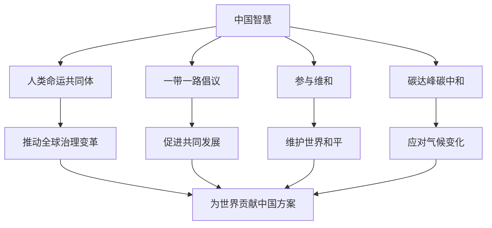

# 综合探究 贡献中国智慧

## 核心概念

**中国智慧**：中国在长期实践中形成的、为解决全球性问题提供的理念、方案和贡献。

**中国方案**：中国提出的解决全球性问题的具体主张和举措，如构建人类命运共同体、"一带一路"倡议。

**中国贡献**：中国为世界和平与发展作出的实际贡献，如参与维和、援助发展中国家、推动全球治理。

## 知识梳理

| 领域 | 中国智慧/方案 | 意义 |
| --- | --- | --- |
| 全球治理 | 人类命运共同体 | 推动治理变革 |
| 经济发展 | 一带一路 | 促进共同发展 |
| 和平安全 | 参与维和 | 维护世界和平 |
| 气候变化 | 碳达峰碳中和 | 应对气候变化 |

## 原理与方法论

**原理**：中国坚持和平发展道路，为世界和平与发展贡献中国智慧和中国方案。

**方法论**：坚持共商共建共享的全球治理观，推动构建人类命运共同体；增强国际视野，讲好中国故事。

## 典型题例

**例**：中国如何为全球治理贡献中国智慧？

**解**：中国提出构建人类命运共同体理念，倡导共商共建共享的全球治理观，推动"一带一路"建设，参与全球气候治理，为完善全球治理体系贡献中国方案。

## 易错点

- 中国智慧是**理念和方案**，中国贡献是**实际行动**。
- 人类命运共同体是核心理念。
- 一带一路促进**共同发展**。
- 中国坚持**和平发展道路**。

## 背记要点

1. 中国智慧：人类命运共同体、一带一路。
2. 中国贡献：维和、援助、全球治理。
3. 全球治理观：共商共建共享。
4. 坚持和平发展道路。

## 自测题

1. 中国提出的全球治理理念是____。
2. 一带一路倡议的意义是____。
3. 中国参与维和体现____。
4. 全球治理观是____。

## 相关知识点

人类命运共同体见 [[第五课 中国的外交：构建人类命运共同体]]；经济全球化见 [[第六课 走进经济全球化：认识经济全球化]]。
