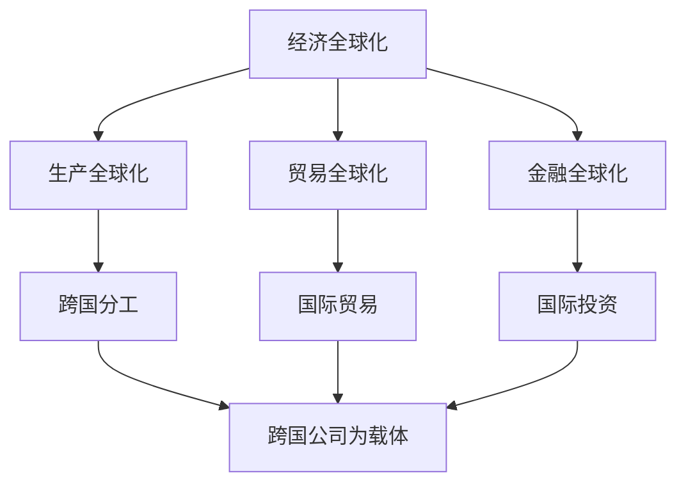

# 第六课 走进经济全球化：认识经济全球化

## 核心概念

**经济全球化**：商品、服务、技术、资本、人员等生产要素在全球范围内流动和配置，各国经济相互联系、相互依赖的趋势。

**经济全球化的表现**：**生产全球化**、**贸易全球化**、**金融全球化**。

**经济全球化的载体**：跨国公司是经济全球化的重要载体。

## 知识梳理

| 表现 | 内容 | 举例 |
| --- | --- | --- |
| 生产全球化 | 生产环节跨国分工 | 国际分工 |
| 贸易全球化 | 商品服务跨国流动 | 国际贸易 |
| 金融全球化 | 资本跨国流动 | 国际投资 |

## 原理与方法论

**原理**：经济全球化是社会生产力发展的客观要求和科技进步的必然结果，是当今世界经济发展的趋势。

**方法论**：顺应经济全球化趋势，积极参与国际分工与合作；同时防范经济全球化带来的风险。

## 典型题例

**例**：为什么说跨国公司是经济全球化的重要载体？

**解**：跨国公司通过在全球范围内配置资源、组织生产和销售，推动生产、贸易、金融的全球化，是经济全球化的重要载体。

## 易错点

- 经济全球化表现：生产、贸易、金融全球化。
- 跨国公司是**重要载体**。
- 经济全球化是**客观趋势**，有利有弊。
- 经济全球化由**生产力发展**和**科技进步**推动。

## 背记要点

1. 经济全球化：生产要素全球流动配置。
2. 表现：生产、贸易、金融全球化。
3. 载体：跨国公司。
4. 是生产力发展和科技进步的必然结果。

## 自测题

1. 经济全球化的表现有____、____、____。
2. 经济全球化的重要载体是____。
3. 经济全球化是____发展的客观要求。
4. 经济全球化有利有____。

## 相关知识点

开放的世界经济见 [[第六课 走进经济全球化：日益开放的世界经济]]；中国与经济全球化见 [[第七课 经济全球化与中国：开放是当代中国的鲜明标识]]。
