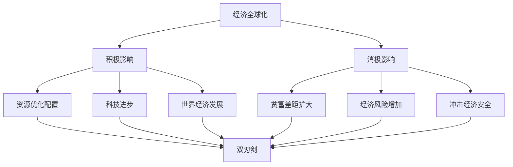

# 第六课 走进经济全球化：日益开放的世界经济

## 核心概念

**经济全球化的影响**：经济全球化是一把**双刃剑**，既促进世界经济发展，也带来风险和挑战。

**经济全球化的积极影响**：促进资源优化配置、推动科技进步、促进世界经济发展、提高人民生活水平。

**经济全球化的消极影响**：加剧贫富差距、增加经济风险、冲击发展中国家经济安全。

## 知识梳理

| 影响 | 表现 |
| --- | --- |
| 积极 | 资源优化配置、科技进步、经济发展 |
| 消极 | 贫富差距、经济风险、冲击经济安全 |
| 实质 | 双刃剑，机遇与挑战并存 |

## 原理与方法论

**原理**：经济全球化是一把双刃剑，既带来机遇也带来挑战。

**方法论**：抓住机遇、迎接挑战，积极参与经济全球化，同时防范风险，维护国家经济安全。

## 典型题例

**例**：为什么说经济全球化是一把双刃剑？

**解**：经济全球化促进资源优化配置、推动世界经济发展，但也加剧贫富差距、增加经济风险、冲击发展中国家经济安全，因此是一把双刃剑。

## 易错点

- 经济全球化是**双刃剑**，机遇与挑战并存。
- 积极影响：资源配置、科技进步、经济发展。
- 消极影响：贫富差距、经济风险、冲击经济安全。
- 要**趋利避害**，防范风险。

## 背记要点

1. 经济全球化是双刃剑。
2. 积极：资源配置、科技进步、经济发展。
3. 消极：贫富差距、经济风险、冲击经济安全。
4. 应对：抓住机遇、防范风险。

## 自测题

1. 经济全球化是一把____。
2. 经济全球化的积极影响有____。
3. 经济全球化的消极影响有____。
4. 应对经济全球化要____。

## 相关知识点

认识经济全球化见 [[第六课 走进经济全球化：认识经济全球化]]；中国与经济全球化见 [[第七课 经济全球化与中国：开放是当代中国的鲜明标识]]。
