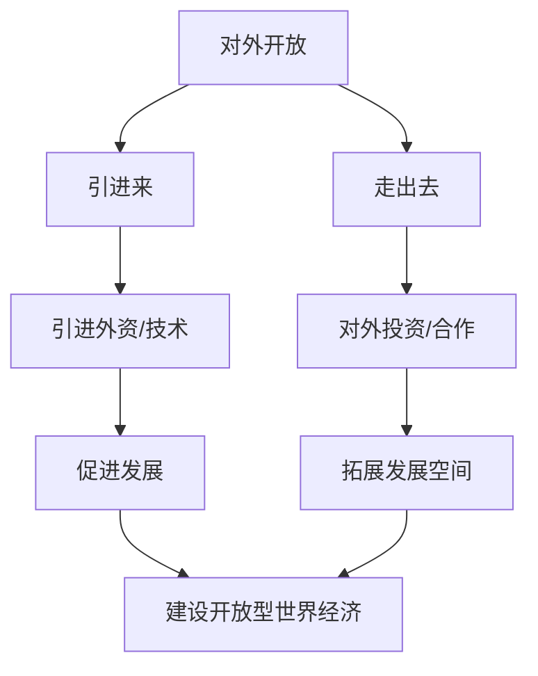

# 第七课 经济全球化与中国：开放是当代中国的鲜明标识

## 核心概念

**对外开放**：我国的基本国策，坚持引进来与走出去相结合。

**开放是当代中国的鲜明标识**：中国坚持对外开放的基本国策，积极参与经济全球化，推动建设开放型世界经济。

**中国参与经济全球化的方式**：引进来（引进外资、技术）与走出去（对外投资、合作）相结合。

## 知识梳理

| 方式 | 内容 | 意义 |
| --- | --- | --- |
| 引进来 | 引进外资、技术 | 促进发展 |
| 走出去 | 对外投资、合作 | 拓展空间 |
| 开放型经济 | 更高水平开放 | 互利共赢 |

## 原理与方法论

**原理**：开放是当代中国的鲜明标识，中国坚持对外开放的基本国策，积极参与经济全球化。

**方法论**：坚持引进来与走出去相结合，发展更高层次的开放型经济，推动建设开放型世界经济。

## 典型题例

**例**：为什么说开放是当代中国的鲜明标识？

**解**：中国坚持对外开放的基本国策，积极参与经济全球化，通过引进来与走出去相结合，推动建设开放型世界经济，为世界发展作出贡献，因此开放是当代中国的鲜明标识。

## 易错点

- 对外开放是我国的**基本国策**。
- 坚持**引进来与走出去相结合**。
- 开放是当代中国的**鲜明标识**。
- 推动建设**开放型世界经济**。

## 背记要点

1. 对外开放是基本国策。
2. 引进来与走出去相结合。
3. 开放是当代中国的鲜明标识。
4. 建设开放型世界经济。

## 自测题

1. 对外开放是我国的____。
2. 中国坚持____与____相结合。
3. 开放是当代中国的____。
4. 中国推动建设____世界经济。

## 相关知识点

做全球发展的贡献者见 [[第七课 经济全球化与中国：做全球发展的贡献者]]；开放型经济见 [[综合探究 发展更高层次开放型经济 完善全球治理]]。
