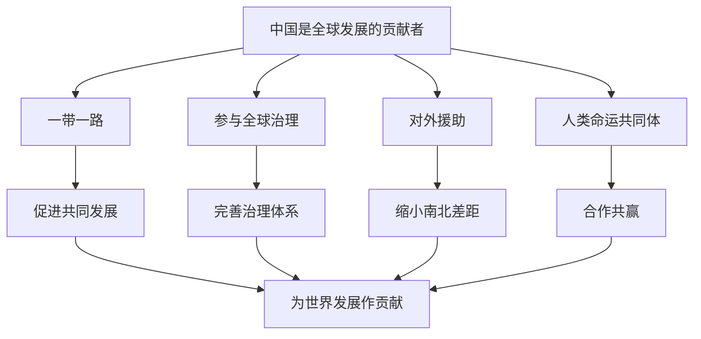

# 第七课 经济全球化与中国：做全球发展的贡献者

## 核心概念

**中国是全球发展的贡献者**：中国坚持互利共赢，为世界经济发展作出重要贡献。

**中国贡献的表现**：推动"一带一路"建设、参与全球治理、援助发展中国家、推动构建人类命运共同体。

**互利共赢**：在合作中实现共同发展，让发展成果惠及各国人民。

## 知识梳理

| 贡献领域 | 内容 | 意义 |
| --- | --- | --- |
| 一带一路 | 基础设施互联互通 | 促进共同发展 |
| 全球治理 | 参与国际规则制定 | 完善治理体系 |
| 对外援助 | 援助发展中国家 | 缩小南北差距 |
| 人类命运共同体 | 合作共赢理念 | 推动世界发展 |

## 原理与方法论

**原理**：中国坚持互利共赢，做全球发展的贡献者，推动构建人类命运共同体。

**方法论**：坚持共商共建共享，推动"一带一路"建设；积极参与全球治理，为世界发展作出中国贡献。

## 典型题例

**例**：中国如何做全球发展的贡献者？

**解**：中国推动"一带一路"建设，参与全球治理，援助发展中国家，倡导合作共赢，为世界经济发展和全球治理作出重要贡献。

## 易错点

- 中国是**全球发展的贡献者**，坚持互利共赢。
- 一带一路促进**共同发展**。
- 中国参与**全球治理**，完善治理体系。
- 中国援助发展中国家，缩小**南北差距**。

## 背记要点

1. 中国是全球发展的贡献者。
2. 一带一路促进共同发展。
3. 参与全球治理、援助发展中国家。
4. 坚持互利共赢、合作共赢。

## 自测题

1. 中国是全球发展的____。
2. 一带一路的意义是____。
3. 中国援助发展中国家可缩小____。
4. 中国坚持____共赢。

## 相关知识点

开放型经济见 [[第七课 经济全球化与中国：开放是当代中国的鲜明标识]]；全球治理见 [[综合探究 发展更高层次开放型经济 完善全球治理]]。
