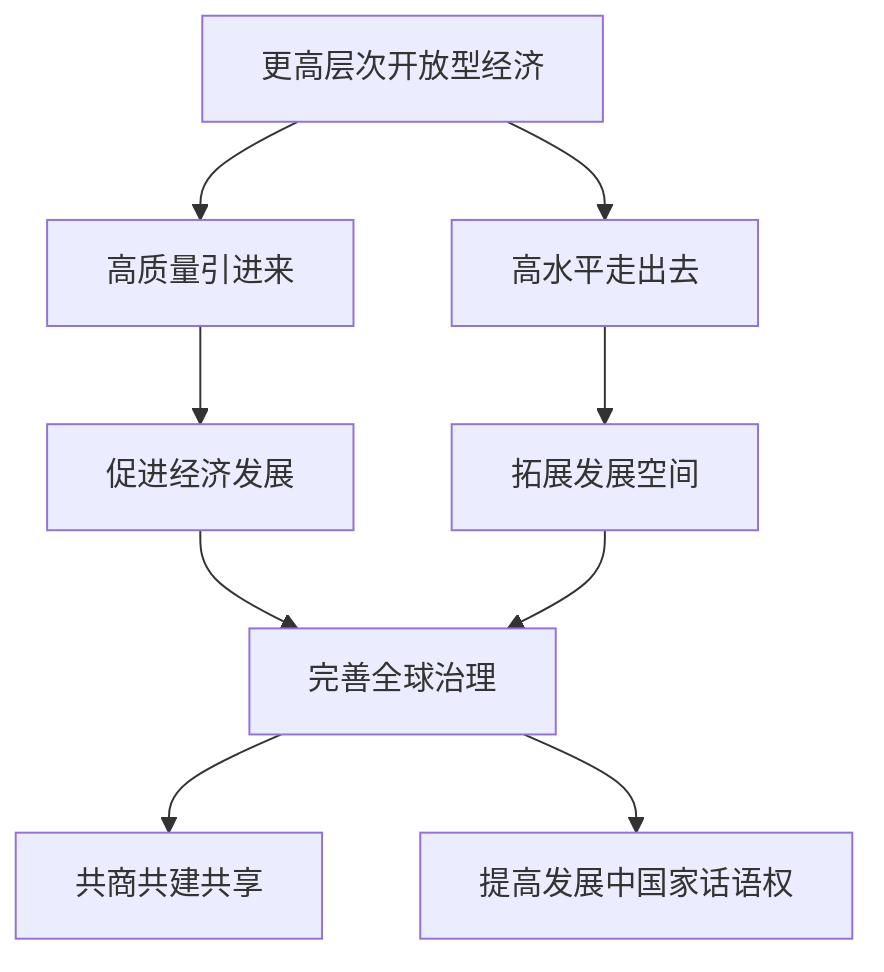

# 综合探究 发展更高层次开放型经济 完善全球治理

## 核心概念

**更高层次开放型经济**：在更大范围、更宽领域、更深层次上推进对外开放，实现高质量引进来和高水平走出去。

**全球治理**：各国共同参与国际事务管理、制定国际规则、解决全球性问题的机制和过程。

**完善全球治理**：推动全球治理体系变革，坚持共商共建共享，提高发展中国家话语权。

## 知识梳理

| 领域 | 内容 | 意义 |
| --- | --- | --- |
| 开放型经济 | 高质量引进来、高水平走出去 | 促进发展 |
| 全球治理 | 共商共建共享 | 完善体系 |
| 国际规则 | 参与制定 | 提高话语权 |

## 原理与方法论

**原理**：发展更高层次开放型经济，完善全球治理，是推动构建人类命运共同体的重要内容。

**方法论**：坚持高质量引进来和高水平走出去，积极参与全球治理，推动全球治理体系变革，提高发展中国家话语权。

## 典型题例

**例**：如何发展更高层次的开放型经济？

**解**：在更大范围、更宽领域、更深层次上推进对外开放，坚持高质量引进来和高水平走出去，优化营商环境，推动制度型开放。

## 易错点

- 更高层次开放型经济强调**高质量、高水平**。
- 全球治理坚持**共商共建共享**。
- 要**提高发展中国家话语权**。
- 完善全球治理需推动**治理体系变革**。

## 背记要点

1. 更高层次开放型经济：高质量引进来、高水平走出去。
2. 全球治理：共商共建共享。
3. 提高发展中国家话语权。
4. 推动全球治理体系变革。

## 自测题

1. 更高层次开放型经济强调____引进来、____走出去。
2. 全球治理坚持____。
3. 完善全球治理要提高____话语权。
4. 推动全球治理____变革。

## 相关知识点

开放型经济见 [[第七课 经济全球化与中国：开放是当代中国的鲜明标识]]；全球发展贡献者见 [[第七课 经济全球化与中国：做全球发展的贡献者]]。
