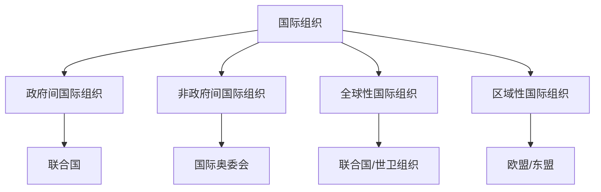

# 第八课 主要的国际组织：日益重要的国际组织

## 核心概念

**国际组织**：国家之间为特定目的、通过条约或协议建立的、具有常设机构的组织。

**国际组织的分类**：按成员性质分为**政府间国际组织**和**非政府间国际组织**；按地理范围分为**全球性**和**区域性**国际组织。

**国际组织的作用**：促进国际合作、协调国际关系、解决国际争端、推动全球治理。

## 知识梳理

| 分类标准 | 类型 | 举例 |
| --- | --- | --- |
| 成员性质 | 政府间/非政府间 | 联合国/国际奥委会 |
| 地理范围 | 全球性/区域性 | 联合国/欧盟 |
| 职能范围 | 一般性/专门性 | 联合国/世卫组织 |

## 原理与方法论

**原理**：国际组织在国际事务中发挥日益重要的作用，是国际关系的重要行为体。

**方法论**：正确认识国际组织的作用，积极参与国际组织活动，推动全球治理。

## 典型题例

**例**：国际组织在国际事务中发挥什么作用？

**解**：国际组织促进国际合作、协调国际关系、解决国际争端、推动全球治理，在国际事务中发挥日益重要的作用。

## 易错点

- 国际组织按成员性质分**政府间**和**非政府间**。
- 按地理范围分**全球性**和**区域性**。
- 联合国是**政府间、全球性、一般性**国际组织。
- 国际组织是国际关系的**重要行为体**。

## 背记要点

1. 国际组织分类：政府间/非政府间、全球性/区域性。
2. 作用：促进合作、协调关系、解决争端、推动治理。
3. 联合国是政府间全球性国际组织。
4. 国际组织日益重要。

## 自测题

1. 国际组织按成员性质分为____和____。
2. 联合国属于____国际组织。
3. 国际组织的作用有____。
4. 国际组织是国际关系的____。

## 相关知识点

联合国见 [[第八课 主要的国际组织：联合国]]；区域性国际组织见 [[第八课 主要的国际组织：区域性国际组织]]。
