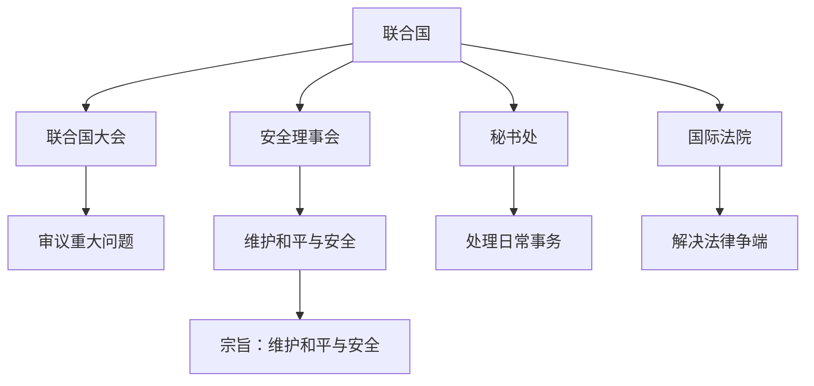

# 第八课 主要的国际组织：联合国

## 核心概念

**联合国**：当今世界最具普遍性、代表性和权威性的**政府间国际组织**，成立于 1945 年。

**联合国的宗旨**：维护国际和平与安全，促进国际合作，以和平方式解决国际争端。

**联合国的原则**：各会员国主权平等、以和平方式解决国际争端、不干涉他国内政等。

**联合国的主要机构**：联合国大会、安全理事会、经济及社会理事会、秘书处、国际法院等。

## 知识梳理

| 机构 | 职能 |
| --- | --- |
| 联合国大会 | 审议、讨论重大问题 |
| 安全理事会 | 维护国际和平与安全 |
| 秘书处 | 处理日常事务 |
| 国际法院 | 解决法律争端 |

## 原理与方法论

**原理**：联合国是当今世界最具普遍性、代表性和权威性的政府间国际组织，在维护世界和平、促进共同发展中发挥重要作用。

**方法论**：支持联合国在国际事务中的核心作用，坚持多边主义，推动构建人类命运共同体。

## 典型题例

**例**：联合国的宗旨是什么？

**解**：维护国际和平与安全，促进国际合作，以和平方式解决国际争端，促进各国友好关系的发展。

## 易错点

- 联合国是**政府间、全球性、一般性**国际组织。
- 安理会是维护**国际和平与安全**的主要机构。
- 联合国坚持**多边主义**。
- 联合国具有**普遍性、代表性和权威性**。

## 背记要点

1. 联合国成立于 1945 年。
2. 宗旨：维护和平与安全、促进合作。
3. 主要机构：大会、安理会、秘书处、国际法院。
4. 最具普遍性、代表性和权威性。

## 自测题

1. 联合国成立于____年。
2. 维护国际和平与安全的主要机构是____。
3. 联合国的宗旨是____。
4. 联合国是____国际组织。

## 相关知识点

国际组织见 [[第八课 主要的国际组织：日益重要的国际组织]]；中国与联合国见 [[第九课 中国与国际组织：中国与联合国]]。
