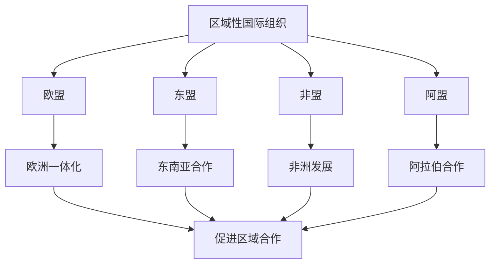

# 第八课 主要的国际组织：区域性国际组织

## 核心概念

**区域性国际组织**：由特定地区的国家组成的国际组织，如欧盟、东盟、非盟、阿盟等。

**欧盟**：欧洲一体化程度最高的区域性国际组织，实行经济政治一体化。

**东盟**：东南亚国家联盟，促进东南亚地区经济合作与安全合作。

**区域性国际组织的作用**：促进区域经济合作、维护地区和平稳定、推动区域一体化。

## 知识梳理

| 组织 | 地区 | 特点 |
| --- | --- | --- |
| 欧盟 | 欧洲 | 一体化程度最高 |
| 东盟 | 东南亚 | 经济安全合作 |
| 非盟 | 非洲 | 促进非洲发展 |
| 阿盟 | 阿拉伯地区 | 政治经济合作 |

## 原理与方法论

**原理**：区域性国际组织促进区域经济合作、维护地区和平稳定，是国际关系的重要力量。

**方法论**：正确认识区域性国际组织的作用，积极参与区域合作，推动区域一体化。

## 典型题例

**例**：欧盟与东盟有何不同？

**解**：欧盟是欧洲一体化程度最高的区域性国际组织，实行经济政治一体化；东盟是东南亚国家联盟，主要促进经济合作与安全合作，一体化程度相对较低。

## 易错点

- 欧盟是**一体化程度最高**的区域性国际组织。
- 东盟促进**经济与安全合作**。
- 区域性国际组织促进**区域合作**和**一体化**。
- 区域性国际组织是国际关系的重要力量。

## 背记要点

1. 区域性国际组织：欧盟、东盟、非盟、阿盟。
2. 欧盟一体化程度最高。
3. 东盟促进经济安全合作。
4. 作用：促进区域合作、维护地区稳定。

## 自测题

1. 一体化程度最高的区域性国际组织是____。
2. 东盟是____国家联盟。
3. 区域性国际组织促进____。
4. 非盟促进____发展。

## 相关知识点

国际组织见 [[第八课 主要的国际组织：日益重要的国际组织]]；中国与新兴国际组织见 [[第九课 中国与国际组织：中国与新兴国际组织]]。
