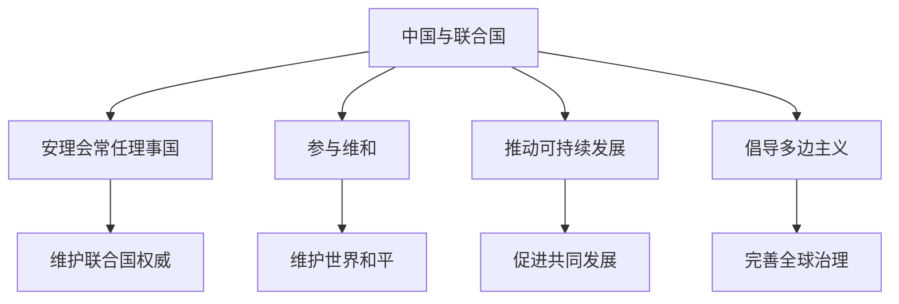

# 第九课 中国与国际组织：中国与联合国

## 核心概念

**中国是联合国创始会员国和安理会常任理事国**，是联合国安理会五个常任理事国之一。

**中国在联合国的作用**：维护联合国权威、支持联合国在国际事务中的核心作用、参与维和行动、推动全球治理。

**中国对联合国的贡献**：参与维和、援助发展中国家、推动可持续发展、倡导多边主义。

## 知识梳理

| 领域 | 中国贡献 |
| --- | --- |
| 维和 | 参与联合国维和行动 |
| 发展 | 推动可持续发展 |
| 治理 | 倡导多边主义 |
| 援助 | 援助发展中国家 |

## 原理与方法论

**原理**：中国是联合国安理会常任理事国，坚定维护联合国权威，支持联合国在国际事务中的核心作用。

**方法论**：坚持多边主义，积极参与联合国事务，为世界和平与发展作出中国贡献。

## 典型题例

**例**：中国在联合国中发挥什么作用？

**解**：中国是安理会常任理事国，坚定维护联合国权威，参与维和行动，推动可持续发展，倡导多边主义，为世界和平与发展作出重要贡献。

## 易错点

- 中国是安理会**五个常任理事国**之一。
- 中国是联合国**创始会员国**。
- 中国坚定维护**联合国权威**。
- 中国倡导**多边主义**。

## 背记要点

1. 中国是安理会常任理事国。
2. 中国是联合国创始会员国。
3. 中国参与维和、推动可持续发展。
4. 中国倡导多边主义。

## 自测题

1. 中国是安理会____常任理事国之一。
2. 中国是联合国____会员国。
3. 中国参与____行动。
4. 中国倡导____。

## 相关知识点

联合国见 [[第八课 主要的国际组织：联合国]]；新兴国际组织见 [[第九课 中国与国际组织：中国与新兴国际组织]]。
