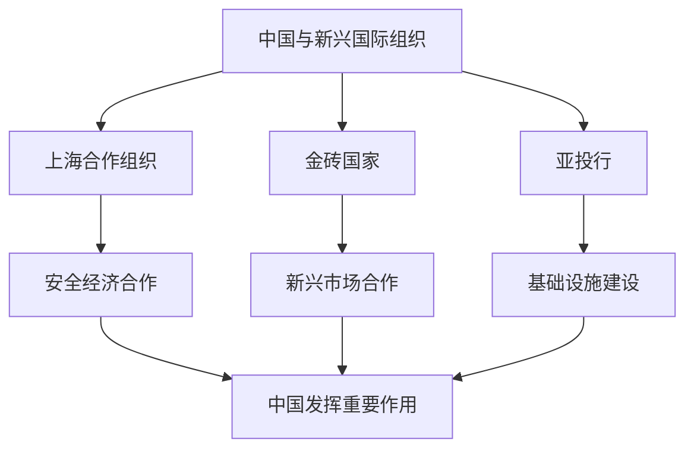

# 第九课 中国与国际组织：中国与新兴国际组织

## 核心概念

**新兴国际组织**：近年来成立或发展起来的、反映新兴市场国家和发展中国家利益诉求的国际组织。

**上海合作组织**：中国参与创建的重要区域性国际组织，促进安全与经济合作。

**金砖国家**：中国、俄罗斯、印度、巴西、南非等新兴市场国家组成的合作机制。

**亚洲基础设施投资银行（亚投行）**：由中国倡议成立的、支持亚洲基础设施建设的多边金融机构。

## 知识梳理

| 组织 | 性质 | 中国作用 |
| --- | --- | --- |
| 上海合作组织 | 区域性安全经济合作 | 创始国 |
| 金砖国家 | 新兴市场合作 | 重要成员 |
| 亚投行 | 多边金融机构 | 倡议成立 |

## 原理与方法论

**原理**：中国积极参与新兴国际组织，推动全球治理体系变革，提高发展中国家话语权。

**方法论**：坚持共商共建共享，积极参与新兴国际组织，推动构建更加公正合理的国际秩序。

## 典型题例

**例**：中国为什么倡议成立亚投行？

**解**：亚投行支持亚洲基础设施建设，弥补亚洲基础设施融资缺口，促进区域互联互通和共同发展，体现中国推动全球治理、促进共同发展的担当。

## 易错点

- 上合组织是**区域性**安全经济合作组织。
- 金砖国家是**新兴市场国家**合作机制。
- 亚投行是**多边金融机构**，由中国倡议成立。
- 中国参与新兴国际组织，提高**发展中国家话语权**。

## 背记要点

1. 新兴国际组织：上合组织、金砖国家、亚投行。
2. 上合组织：安全经济合作。
3. 亚投行：中国倡议成立的多边金融机构。
4. 提高发展中国家话语权。

## 自测题

1. 中国倡议成立的金融机构是____。
2. 上合组织促进____合作。
3. 金砖国家是____合作机制。
4. 中国参与新兴国际组织提高____话语权。

## 相关知识点

中国与联合国见 [[第九课 中国与国际组织：中国与联合国]]；区域性国际组织见 [[第八课 主要的国际组织：区域性国际组织]]。
