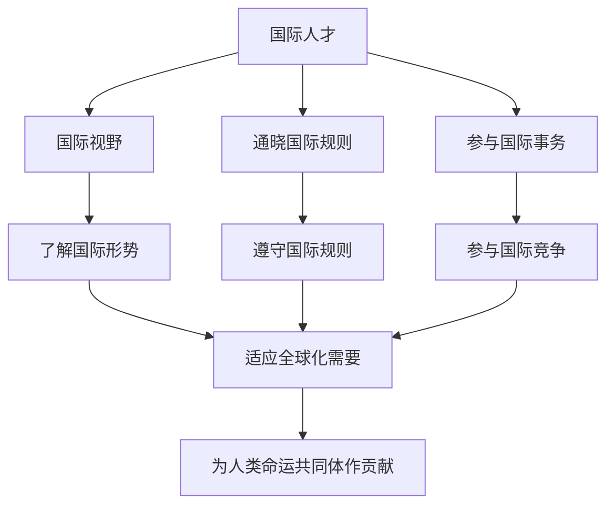

# 综合探究 国际视野及国际人才

## 核心概念

**国际视野**：从全球角度观察、分析和处理问题的能力，包括了解国际形势、尊重文化差异、关注全球性问题。

**国际人才**：具有国际视野、通晓国际规则、能够参与国际事务和国际竞争的高素质人才。

**培养国际人才的意义**：适应经济全球化和国际竞争的需要，为构建人类命运共同体贡献力量。

## 知识梳理

| 素养 | 内容 | 意义 |
| --- | --- | --- |
| 国际视野 | 了解国际形势、尊重差异 | 正确认识世界 |
| 国际规则 | 通晓国际规则 | 参与国际事务 |
| 国际竞争 | 提升竞争力 | 服务国家发展 |

## 原理与方法论

**原理**：经济全球化需要具有国际视野和国际竞争力的人才，培养国际人才是适应时代发展的要求。

**方法论**：树立国际视野，学习国际规则，提升国际竞争力，为构建人类命运共同体贡献力量。

## 典型题例

**例**：新时代青年应如何培养国际视野？

**解**：关注国际形势，学习国际规则，尊重文化差异，提升外语和跨文化交流能力，增强国际竞争力，为世界和平与发展贡献力量。

## 易错点

- 国际视野是**从全球角度**观察分析问题的能力。
- 国际人才需**通晓国际规则**。
- 培养国际人才适应**经济全球化**需要。
- 国际人才为构建**人类命运共同体**作贡献。

## 背记要点

1. 国际视野：从全球角度观察分析问题。
2. 国际人才：有视野、通规则、能参与国际事务。
3. 意义：适应全球化、服务国家发展。
4. 为人类命运共同体作贡献。

## 自测题

1. 国际视野是从____角度观察分析问题。
2. 国际人才需____国际规则。
3. 培养国际人才适应____需要。
4. 国际人才为____作贡献。

## 相关知识点

中国与联合国见 [[第九课 中国与国际组织：中国与联合国]]；新兴国际组织见 [[第九课 中国与国际组织：中国与新兴国际组织]]。
