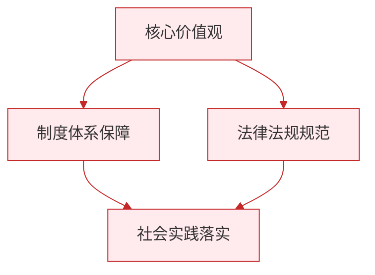

# 认识自己

标签：#少年有梦 #自我认识 #成长

## 一、本知识点定位

统编版道德与法治七年级上册 **第一单元 少年有梦 第二课 正确认识自我 第一框「认识自己」**。本框讲为什么要认识自己、可以从哪些方面认识自己、通过什么途径认识自己。

## 二、核心观点

1. 人贵自知，**正确认识自己很重要**。
2. 正确认识自己，可以促进**自我发展**：了解自己的特点，发挥优势，扬长避短。
3. 正确认识自己，可以促进**与他人的交往**：更好地理解、宽容和善待他人。
4. 我们可以从**身体特征、心理状况、社会关系**等方面认识自己。
5. 认识自己的途径主要有两条：**自我评价**和**他人评价**。
6. 对待他人评价，要客观冷静分析，既不盲从，也不忽视，做到**用理性的心态面对**。

## 三、知识梳理

### 1. 为什么要正确认识自己（为什么）

- 正确认识自己，才能发现自己的优势与不足，明确努力方向，促进自我发展。
- 正确认识自己，有助于增强对自己的信心。
- 正确认识自己，才能更好地理解他人、与他人相处，促进与他人的交往。

### 2. 从哪些方面认识自己（是什么）

- **身体特征和生理状况**：如身高、体重、健康状况。
- **心理状况**：如性格、气质、兴趣、能力。
- **社会关系中的自己**：如在家庭中是子女、在学校里是学生、在班级里担任的角色。

### 3. 通过什么途径认识自己（怎么做）

- **自我评价**：通过自我观察、反思总结、与他人比较等方式认识自己。
- **他人评价**：他人的评价是认识自己的一面镜子，有助于形成更客观、完整、清晰的自我认识。
- 对待他人评价的正确态度：客观冷静分析，既不因赞美而骄傲，也不因批评而气馁；有则改之，无则加勉。

## 四、重要概念

| 术语 | 定义 |
|---|---|
| 自我认识 | 一个人对自己身体、心理、社会角色等方面的了解和评价 |
| 自我评价 | 自己对自己作出的评价，可通过自我观察、反思等方式进行 |
| 他人评价 | 他人对自己作出的评价，是认识自己的一面镜子 |
| 人贵自知 | 能正确认识自己是可贵的品质 |

## 五、联系生活

小杰竞选班委落选后很沮丧，觉得自己一无是处。班主任提醒他：落选只说明演讲经验不足，但他做事认真、乐于助人是大家公认的。小杰冷静想了想，主动申请当了小组长，从组织小组活动练起。他既听取了他人评价，又没有被一次挫折否定全部的自己——这就是理性认识自己。

## 六、背记要点

1. 人贵自知，正确认识自己很重要。
2. 正确认识自己，可以促进自我发展。
3. 正确认识自己，可以促进与他人的交往。
4. 可以从身体特征、心理状况、社会关系等方面认识自己。
5. 认识自己的途径：自我评价和他人评价。
6. 他人评价是认识自己的一面镜子。
7. 对待他人评价要客观冷静分析，既不盲从，也不忽视。

## 七、自测小题

1. 认识自己的两条主要途径是______评价和______评价。
2. 他人的评价是认识自己的一面______。
3. "在家里我是女儿，在学校我是学生"，这是从______方面认识自己（A. 身体特征 B. 心理状况 C. 社会关系）。
4. 面对同学的批评，正确做法是（A. 立刻反驳 B. 全盘接受 C. 客观分析，有则改之，无则加勉）。
5. 判断：认识自己只需要靠自我评价，别人的看法不重要。（对/错）
6. 简答：为什么要正确认识自己？

**答案**：1. 自我；他人 2. 镜子 3. C 4. C 5. 错（他人评价有助于形成更客观完整的自我认识）
6. 答题要点：①正确认识自己可以促进自我发展，了解自己的特点、发挥优势；②可以增强对自己的信心；③可以促进与他人的交往，更好地理解、宽容和善待他人。

相关：[[做更好的自己]] ｜ [[奏响中学序曲]]

### 政治理论与逻辑框架

