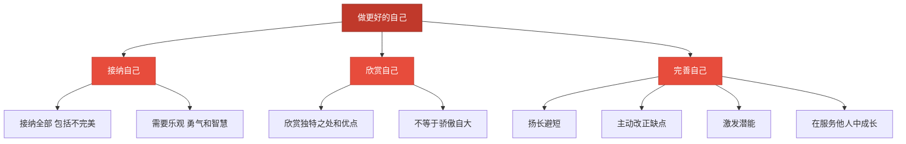

# 做更好的自己

标签：#少年有梦 #自我完善 #接纳自己

## 一、本知识点定位

统编版道德与法治七年级上册 **第一单元 少年有梦 第二课 正确认识自我 第二框「做更好的自己」**。本框在"认识自己"的基础上，讲怎样接纳自己、欣赏自己，不断完善自己。

## 二、核心观点

1. 我们要学会**接纳自己**：接纳自己的全部，既接纳优点，也接纳不完美。
2. 我们要学会**欣赏自己**：欣赏自己的独特、优点、努力和为他人的奉献。
3. 欣赏自己不是骄傲自大、目中无人，而是发自内心地悦纳自己。
4. 做更好的自己，要**扬长避短**，发挥自己的优势，弥补或避开自己的短处。
5. 做更好的自己，需要**主动改正缺点**，不断激发自己的潜能。
6. 做更好的自己，是在**为他人、为社会带来福祉的过程中**实现的。

## 三、知识梳理

### 1. 接纳与欣赏自己（是什么）

- **接纳自己**：接纳自己的全部——性格、外貌、能力、过去的经历；接纳需要乐观的态度、勇气和智慧。
- **欣赏自己**：欣赏自己的独特之处、优点长处、付出的努力和对他人的贡献；欣赏自己要适度，不能变成自我陶醉、目中无人。

### 2. 为什么要做更好的自己（为什么）

- 每个人都不是完美的，但每个人都有自己的价值和潜能。
- 只有接纳和欣赏自己，才能获得自信，拥有向上生长的力量。
- 生命是一个不断成长的过程，做更好的自己是对自己负责，也是对社会的贡献。

### 3. 怎样做更好的自己（怎么做）

- **扬长避短**：发现并发挥自己的优势，善于扬长；正视短处，学会避短。
- **主动改正缺点**：改正缺点需要勇气和毅力，可以从小事做起、请同伴督促。
- **不断激发潜能**：通过尝试新事物、迎接挑战，发现和开发自己的潜能。
- **在服务他人中成长**：在帮助他人、服务社会的过程中成就更好的自己。

## 四、重要概念

| 术语 | 定义 |
|---|---|
| 接纳自己 | 接受自己的全部，包括优点和不完美之处 |
| 欣赏自己 | 发自内心地肯定自己的独特、优点、努力与贡献 |
| 扬长避短 | 发挥自己的长处，弥补或避开自己的短处 |
| 潜能 | 潜藏在每个人身上、尚未表现出来的能力 |

## 五、联系生活

小雨个子不高，一度很自卑。后来她发现自己声音清亮、朗读有感情，就报名参加了校园广播站，成了大家喜爱的播音员。她还坚持每天练字，改掉了作业潦草的毛病。小雨没有纠结于改变不了的身高，而是发挥长处、改正缺点——这正是"做更好的自己"。

## 六、背记要点

1. 接纳自己，要接纳自己的全部，需要乐观、勇气和智慧。
2. 欣赏自己，欣赏自己的独特、优点、努力和奉献。
3. 欣赏自己不等于骄傲自大、自我陶醉。
4. 做更好的自己，要扬长避短。
5. 做更好的自己，需要主动改正缺点。
6. 做更好的自己，需要不断激发自己的潜能。
7. 做更好的自己，是在为他人、为社会带来福祉的过程中实现的。

## 七、自测小题

1. 接纳自己，需要接纳自己的______，既包括优点，也包括不完美。
2. 做更好的自己，要扬长______。
3. 欣赏自己与骄傲自大的区别在于（A. 没有区别 B. 欣赏自己是悦纳自己，骄傲自大是目中无人 C. 欣赏自己就是只看优点）。
4. 判断：改正缺点很难，所以不完美的地方就随它去吧。（对/错）
5. 判断：做更好的自己只是自己的事，与他人和社会无关。（对/错）
6. 简答：怎样做更好的自己？

**答案**：1. 全部 2. 避短 3. B 4. 错（改正缺点需要勇气和毅力，可以从小事做起） 5. 错（做更好的自己是在为他人、为社会带来福祉的过程中实现的）
6. 答题要点：①学会接纳自己、欣赏自己；②扬长避短，发挥优势；③主动改正缺点；④不断激发自己的潜能；⑤在为他人、为社会作贡献的过程中成就更好的自己。

相关：[[认识自己]] ｜ [[做有梦想的少年]]
