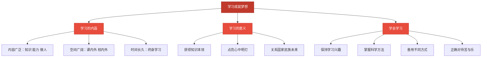

# 学习成就梦想

标签：#少年有梦 #学习 #终身学习

## 一、本知识点定位

统编版道德与法治七年级上册 **第一单元 少年有梦 第三课 梦想始于当下 第二框「学习成就梦想」**。本框讲学习的含义与意义，以及怎样通过学习去实现梦想。

## 二、核心观点

1. **梦想的实现离不开学习**，学习是梦想与现实之间的桥梁。
2. 学习不仅指知识的获取，还包括**各种能力的培养**；学习不局限于学校，生活中的点点滴滴都可以是学习。
3. 学习伴随我们的成长，我们要树立**终身学习**的观念。
4. 学习中有快乐，也有辛苦；付出努力、克服困难后收获成长，是学习真正的乐趣。
5. **学会学习**，需要发现并保持对学习的兴趣，掌握科学的学习方法，善于运用不同的学习方式。

## 三、知识梳理

### 1. 怎样理解学习（是什么）

- 学习的内容是广泛的：不仅要学知识，还要学做人、学做事，培养各种能力。
- 学习的空间是广阔的：课堂内外、学校内外，处处可以学习。
- 学习的时间是长久的：学习没有终点，要树立终身学习的观念。

### 2. 为什么学习能成就梦想（为什么）

- 学习让我们获得知识和本领，为实现梦想打下基础。
- 学习点亮我们心中的明灯，帮助我们认识世界、发现自己的潜能。
- 学习让我们拥有更充实的生活，获得成长的力量；个人的学习也关系国家和民族的未来。

### 3. 怎样学会学习（怎么做）

- **保持学习兴趣**：兴趣是最好的老师，带着兴趣学习事半功倍。
- **掌握科学方法**：如课前预习、课上专注、课后复习、及时整理错题。
- **善用不同方式**：自主学习、合作学习、探究学习相结合。
- **正确对待苦与乐**：学习需要刻苦，坚持下来才能体会到学习的美好。

## 四、重要概念

| 术语 | 定义 |
|---|---|
| 学习 | 通过阅读、听讲、实践等获得知识、培养能力的活动，不限于学校课堂 |
| 终身学习 | 学习贯穿人的一生，随时随地都要学习的观念 |
| 学会学习 | 保持兴趣、掌握方法、善用方式，让学习更有效 |
| 合作学习 | 与同伴互相帮助、共同完成学习任务的方式 |

## 五、联系生活

小磊数学基础薄弱，一开始一遇到难题就放弃。后来他调整方法：每天先复习当天例题再做作业，把错题抄进错题本，周末和同学组成学习小组互相讲题。一个学期下来，他不仅成绩提高了，还发现给别人讲题时自己理解得更透彻。这说明：科学的方法和合作学习能让学习更有效，坚持之后能体会学习的乐趣。

## 六、背记要点

1. 梦想的实现离不开学习，学习是梦想与现实之间的桥梁。
2. 学习不仅是知识的获取，还包括各种能力的培养。
3. 学习没有终点，要树立终身学习的观念。
4. 学习中有快乐也有辛苦，克服困难后的成长是学习真正的乐趣。
5. 学会学习，要发现并保持对学习的兴趣。
6. 学会学习，要掌握科学的学习方法。
7. 学会学习，要善于运用不同的学习方式。

## 七、自测小题

1. 学习是梦想与现实之间的______。
2. 学习贯穿一生，我们要树立______学习的观念。
3. "兴趣是最好的老师"说明学会学习首先要（A. 多做题 B. 保持学习兴趣 C. 延长学习时间）。
4. 判断：学习只发生在学校课堂上。（对/错）
5. 判断：学习是辛苦的，所以学习中没有快乐可言。（对/错）
6. 简答：怎样学会学习？

**答案**：1. 桥梁 2. 终身 3. B 4. 错（生活处处可以学习） 5. 错（学习有苦有乐，克服困难后收获成长是真正的乐趣）
6. 答题要点：①发现并保持对学习的兴趣；②掌握科学的学习方法，如预习、复习、整理错题；③善于运用自主、合作、探究等不同学习方式；④正确对待学习中的苦与乐，坚持不懈。

相关：[[做有梦想的少年]] ｜ [[规划初中生活]]
