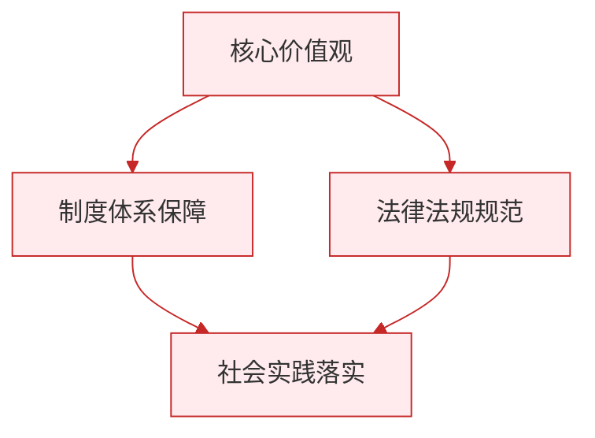

# 让家更美好

标签：#成长的时空 #家庭 #亲子沟通

## 一、本知识点定位

统编版道德与法治七年级上册 **第二单元 成长的时空 第四课 幸福和睦的家庭 第二框「让家更美好」**。本框讲现代家庭的特点、家庭美德，以及怎样以实际行动建设美好家庭。

## 二、核心观点

1. 现代家庭的结构、规模、观念等发生了变化，**沟通交流方式也在改变**，但亲情始终是家庭的纽带。
2. 美好家庭需要**用心体味亲情之爱**：亲情有不同的表现形式，可能是温柔的、可能是严厉的，都是爱。
3. 美好家庭需要**传承中华民族传统家庭美德**，如尊老爱幼、勤俭持家、邻里互助。
4. 美好家庭需要**相互理解、信任、体谅和包容**，家庭成员之间难免有碰撞，要学会化解。
5. 家庭成员**共同建设**才能让家更美好；我们是家庭的一员，也是让家更美好的参与者、贡献者。

## 三、知识梳理

### 1. 现代家庭的变化（是什么）

- 家庭结构、规模发生变化：核心家庭增多，家庭规模趋小。
- 家庭观念和沟通方式变化：更注重平等交流，也可以借助网络等方式联系。
- 不变的是：亲情之爱依然是家庭的核心。

### 2. 为什么要共建美好家庭（为什么）

- 家和万事兴，和睦的家庭是每个成员幸福生活的基础。
- 家庭中的矛盾冲突（如亲子之间的分歧）如果处理不当，会伤害亲情。
- 每个成员都是家庭的建设者，家庭的美好需要大家共同付出。

### 3. 怎样让家更美好（怎么做）

- **用心体味亲情**：理解父母不同方式表达的爱，包括严格要求背后的关心。
- **有效沟通**：与父母发生分歧时，冷静表达自己的想法，认真倾听父母的意见，求同存异。
- **传承家庭美德**：孝老爱亲、勤俭节约，从自己做起。
- **主动分担**：承担力所能及的家务，关心家人，为家庭建设出力。

## 四、重要概念

| 术语 | 定义 |
|---|---|
| 核心家庭 | 由父母与未婚子女组成的家庭 |
| 亲情之爱 | 家庭成员之间基于血缘与共同生活形成的深厚感情 |
| 家庭美德 | 尊老爱幼、勤俭持家等中华民族世代相传的家庭道德规范 |
| 有效沟通 | 冷静表达、认真倾听、相互理解，化解分歧的交流方式 |

## 五、联系生活

小磊想周末和同学去打球，妈妈担心影响复习不同意，两人吵了起来。冷静后，小磊向妈妈说明自己已经完成了复习计划，并保证按时回家；妈妈也说出了自己的担心，最后同意他去两个小时。一次好的沟通，比赌气和顶撞更能解决问题——理解与体谅是化解亲子矛盾的钥匙。

## 六、背记要点

1. 现代家庭的结构、规模、观念在变化，但亲情始终是家庭的纽带。
2. 亲情之爱有不同的表现形式，严格要求也是爱。
3. 让家更美好，要传承尊老爱幼、勤俭持家等家庭美德。
4. 家庭成员之间要相互理解、信任、体谅和包容。
5. 与父母有分歧时，要冷静沟通、认真倾听、求同存异。
6. 我们要主动承担家务，做家庭美好的建设者。

## 七、自测小题

1. 现代家庭中，______始终是家庭的纽带。
2. 尊老爱幼、勤俭持家属于中华民族的传统______美德。
3. 与父母发生分歧时，正确的做法是（A. 摔门而去 B. 冷静沟通、认真倾听 C. 冷战到底）。
4. 判断：父母对我们要求严格，说明他们不爱我们。（对/错）
5. 判断：建设美好家庭是父母的事，与孩子无关。（对/错）
6. 简答：怎样让家更美好？

**答案**：1. 亲情 2. 家庭 3. B 4. 错（严格要求也是爱的表现） 5. 错（每个家庭成员都是建设者）
6. 答题要点：①用心体味亲情之爱，理解父母表达爱的不同方式；②与家人有效沟通，相互理解、体谅和包容；③传承中华民族传统家庭美德；④主动承担力所能及的家务，为家庭建设出力。

相关：[[家的意味]] ｜ [[共建美好集体]]

### 政治理论与逻辑框架

