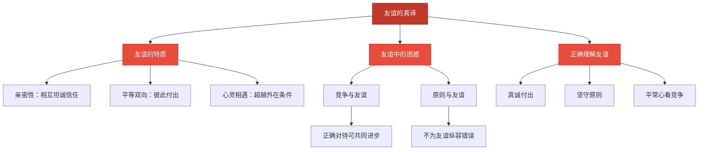

# 友谊的真谛

标签：#成长的时空 #友谊 #同伴交往

## 一、本知识点定位

统编版道德与法治七年级上册 **第二单元 成长的时空 第六课 友谊之树常青 第一框「友谊的真谛」**。本框讲友谊的特质，帮助我们澄清对友谊的认识。

## 二、核心观点

1. 友谊是一种**亲密的关系**，朋友之间相互了解、相互信任、相互接纳。
2. 友谊是**平等的、双向的**：接受关怀也要付出关怀，感受温暖也要给予温暖。
3. 友谊是一种**心灵的相遇**：真正的友谊建立在志趣相投、相互欣赏的基础上，超越物质条件、家庭背景、学习成绩等外在因素。
4. 竞争并不必然伤害友谊，关键是**正确对待竞争**：在竞争中共同进步，做到自我反省和包容。
5. 友谊不能没有原则：真正的朋友会指出对方的错误，**不为维护"友谊"而放弃原则**。

## 三、知识梳理

### 1. 友谊的特质（是什么）

- **亲密性**：朋友之间相互坦诚、彼此信任，分享快乐、分担忧愁。
- **平等双向**：友谊需要彼此付出，只索取不付出的关系难以长久。
- **心灵相遇**：友谊源于共同的志趣和相互欣赏，与钱财、成绩、相貌等外在条件无关。

### 2. 友谊中的常见困惑（为什么）

- **朋友变多变少**：随着成长，朋友圈会变化，友谊需要经营，也要接受自然的变化。
- **竞争与友谊**：与朋友竞争是正常的，正确对待可以共同进步，不必因害怕竞争而回避友谊。
- **原则与友谊**：为朋友隐瞒错误、"两肋插刀"违反规则，不是真友谊。

### 3. 怎样理解真正的友谊（怎么做）

- 用真诚换真诚：主动付出关怀，不斤斤计较。
- 用原则守友谊：朋友做错事要善意提醒和劝阻，而不是纵容包庇。
- 用平常心看竞争：欣赏朋友的进步，在竞争中互相激励。

## 四、重要概念

| 术语 | 定义 |
|---|---|
| 友谊 | 朋友之间相互了解、信任、接纳的亲密关系 |
| 平等双向 | 友谊中双方都要付出关怀与温暖，而非单方索取 |
| 心灵的相遇 | 友谊建立在志趣相投、相互欣赏之上，超越外在条件 |
| 讲原则的友谊 | 真友谊不迁就错误，敢于善意指出朋友的问题 |

## 五、联系生活

小丹和小蕾是好朋友，期中考试小蕾超过了小丹，小丹一度心里不是滋味。后来她想通了：朋友进步值得高兴，自己该做的是向她请教方法、一起进步。期末两人成绩都提高了。另一次，小蕾想抄小丹的作业，小丹拒绝了，但主动给她讲题——真正的友谊经得起竞争，也守得住原则。

## 六、背记要点

1. 友谊是一种亲密的关系，需要相互了解、信任、接纳。
2. 友谊是平等的、双向的。
3. 友谊是一种心灵的相遇，超越物质条件等外在因素。
4. 竞争并不必然伤害友谊，关键是正确对待竞争。
5. 友谊不能没有原则，不能为"友谊"纵容朋友的错误。
6. 呵护友谊需要真诚付出、用心经营。

## 七、自测小题

1. 友谊是______的、双向的。
2. 友谊是一种心灵的______。
3. 朋友考试超过了自己，正确态度是（A. 疏远朋友 B. 为朋友高兴，互相激励共同进步 C. 暗中较劲不再来往）。
4. 朋友要抄你的作业，你应该（A. 给他抄，够朋友 B. 拒绝并帮他弄懂题目 C. 告诉所有人他想抄作业）。
5. 判断：家庭条件相差大的两个人不可能成为真正的朋友。（对/错）
6. 简答：友谊有哪些特质？

**答案**：1. 平等 2. 相遇 3. B 4. B 5. 错（友谊超越物质条件等外在因素）
6. 答题要点：①友谊是一种亲密的关系，相互了解、信任、接纳；②友谊是平等的、双向的，需要彼此付出；③友谊是一种心灵的相遇，建立在志趣相投、相互欣赏之上，超越外在条件。

相关：[[交友的智慧]] ｜ [[集体生活成就我]]
