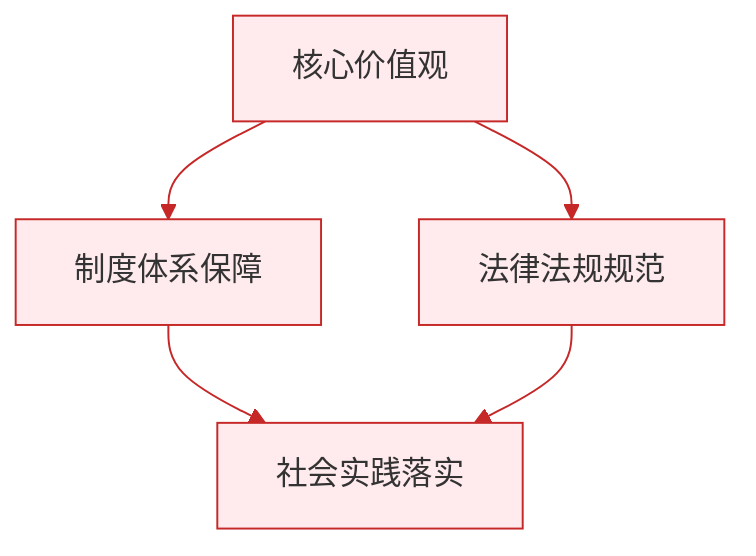

# 集体生活成就我

标签：#成长的时空 #集体 #个人成长

## 一、本知识点定位

统编版道德与法治七年级上册 **第二单元 成长的时空 第七课 在集体中成长 第一框「集体生活成就我」**。本框讲集体的含义、集体对个人成长的作用。

## 二、核心观点

1. 集体是人们**联合起来的有组织的整体**，我们每个人都生活在各种集体之中。
2. 集体为个人的成长**提供了广阔的空间和丰富的资源**。
3. 在集体中，我们获得**安全感和归属感**，感受集体的温暖。
4. 集体生活可以**培养我们的品格**：学会遵守规则、承担责任、关爱他人。
5. 集体生活可以**发展我们的个性**：在与不同个性的同伴交往中认识自己、完善自己，发现和发展自己的才能。
6. 个人的成长离不开集体，集体的发展也离不开每个成员的努力。

## 三、知识梳理

### 1. 什么是集体（是什么）

- 集体是人们联合起来的有组织的整体，如班级、学校、社团、国家。
- 集体不是人的简单聚集，而是有共同目标、有分工协作的整体。

### 2. 集体生活怎样成就我（为什么）

- **给予温暖和力量**：在集体中被接纳、被关爱，获得安全感与归属感；集体荣誉激发自豪感。
- **培养品格**：集体生活要求我们遵守规则、履行职责，在共同活动中学会合作、学会奉献。
- **发展个性**：集体是个性展示的舞台，与同伴的交流碰撞帮助我们认识自己、取长补短，发展兴趣与才能。

### 3. 怎样对待集体生活（怎么做）

- 主动融入集体，积极参加集体活动。
- 在集体中认真承担自己的职责，为集体贡献力量。
- 借助集体平台锻炼自己，在服务集体中成长。

## 四、重要概念

| 术语 | 定义 |
|---|---|
| 集体 | 人们联合起来的有组织的整体 |
| 归属感 | 个人感到自己被集体接纳、属于集体的心理感受 |
| 集体荣誉感 | 为集体的成绩感到光荣、自豪的情感 |
| 个性发展 | 在集体交往中认识自己、完善自己，发展才能与特长 |

## 五、联系生活

运动会前，班里组织入场式排练。小峰本来觉得麻烦，但在排练中他负责喊口号，发现自己声音洪亮、有组织能力；比赛时全班齐心协力拿了年级第一，他和同学们一起欢呼。那一刻的自豪感让他体会到：集体不仅带来荣誉和温暖，也让每个人找到展示自己的舞台。

## 六、背记要点

1. 集体是人们联合起来的有组织的整体。
2. 集体为个人成长提供广阔空间和丰富资源。
3. 在集体中我们获得安全感和归属感。
4. 集体生活培养我们的品格：守规则、担责任、会合作。
5. 集体生活帮助我们发展个性、发现才能。
6. 个人的成长离不开集体。

## 七、自测小题

1. 集体是人们联合起来的有______的整体。
2. 在集体中，我们获得安全感和______感。
3. 集体生活对个性发展的作用是（A. 让所有人变得一样 B. 帮助我们认识自己、发展才能 C. 压抑个性）。
4. 判断：集体生活只会束缚个人，对个人成长没有好处。（对/错）
5. 判断：班级获得荣誉与我个人无关。（对/错）
6. 简答：集体生活是怎样成就我们的？

**答案**：1. 组织 2. 归属 3. B 4. 错（集体为个人成长提供空间和资源） 5. 错（集体荣誉属于每个成员，个人应为集体贡献力量）
6. 答题要点：①集体给予我们温暖和力量，让我们获得安全感、归属感和集体荣誉感；②集体生活培养我们的品格，学会遵守规则、承担责任、关爱他人；③集体生活帮助我们发展个性，在交往中认识自己、发展才能。

相关：[[共建美好集体]] ｜ [[友谊的真谛]]

### 政治理论与逻辑框架

