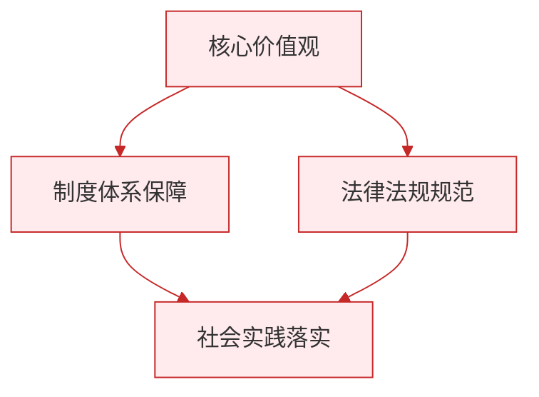

# 提高防护能力

标签：#珍爱生命 #自救自护 #应急避险

## 一、本知识点定位

统编版道德与法治七年级上册 **第三单元 珍爱我们的生命 第九课 守护生命安全 第二框「提高防护能力」**。本框讲在增强安全意识的基础上，怎样掌握防护知识和技能，提高应对危险的能力。

## 二、核心观点

1. 守护生命安全，不仅要有安全意识，还要**提高防护能力**。
2. 提高防护能力，需要**学习防护知识**，了解不同危险情境的应对方法。
3. 提高防护能力，需要**掌握基本的自救自护技能**，并通过演练形成本领。
4. 遭遇危险时，要**保持冷静**，理性判断，运用所学方法机智应对。
5. 提高防护能力，还要**善于借助外部力量**：及时求助老师、家长、警察等，学会拨打紧急求助电话。

## 三、知识梳理

### 1. 常见危险的应对方法（是什么）

- **火灾**：用湿毛巾捂住口鼻，低姿弯腰沿安全通道撤离；不乘电梯，不贪恋财物；拨打119。
- **地震**：室内就近躲在坚固桌下或墙角，护住头部；震后有序撤离到空旷地带。
- **溺水施救**：同伴落水不盲目下水，应大声呼救、寻找漂浮物抛掷、拨打110/120求助。
- **交通事故**：拨打122和120，保护现场、留意肇事车辆信息。
- **遇到不法侵害**：保持冷静，以保护生命为第一原则，可以呼救、周旋、事后报警，不与歹徒硬拼。

### 2. 为什么要提高防护能力（为什么）

- 有意识没能力，遇到危险仍可能手足无措。
- 掌握正确的方法能在关键时刻自救并帮助他人，把伤害降到最低。
- 防护能力是通过学习和演练获得的，人人都可以掌握。

### 3. 怎样提高防护能力（怎么做）

- 认真学习防护知识，了解各类灾害与危险的特点。
- 积极参加应急疏散演练、急救培训，把知识变成技能。
- 记住常用求助电话：110（报警）、119（火警）、120（急救）、122（交通事故）。
- 遇险时保持镇定，先保生命，再视情况保护财产。

## 四、重要概念

| 术语 | 定义 |
|---|---|
| 防护能力 | 应对危险、保护自己和他人生命安全的知识与技能 |
| 自救自护 | 遭遇危险时依靠自己掌握的方法脱离险境、减少伤害 |
| 应急演练 | 模拟灾害情境进行的疏散、避险训练 |
| 紧急求助电话 | 110报警、119火警、120急救、122交通事故 |

## 五、联系生活

学校组织消防疏散演练，警报响起后，小林按照平时学的要领：用湿纸巾捂住口鼻、弯腰低姿、靠右快走、不推挤，两分钟内和全班安全到达操场集合点。老师说："演练时多流汗，遇险时才不慌张。"防护能力正是在一次次认真的演练中练出来的。

## 六、背记要点

1. 守护生命安全，既要增强安全意识，又要提高防护能力。
2. 火灾逃生：湿毛巾捂口鼻、低姿撤离、不乘电梯。
3. 地震避险：室内躲桌下护头，震后撤到空旷地带。
4. 同伴溺水：不盲目下水，呼救、抛漂浮物、打电话求助。
5. 遇到不法侵害，以保护生命为第一原则，机智应对。
6. 常用求助电话：110、119、120、122。
7. 防护能力要通过学习知识和参加演练来获得。

## 七、自测小题

1. 火灾逃生时应用湿毛巾捂住口鼻，______姿撤离，不乘坐______。
2. 火警电话是______，急救电话是______。
3. 同伴落水，初中生正确的做法是（A. 立刻跳下水救人 B. 呼救并抛掷漂浮物、打电话求助 C. 吓得跑掉）。
4. 地震发生时正在教室，应该（A. 跳窗逃生 B. 躲到坚固课桌下护住头部 C. 挤向门口）。
5. 判断：遇到持械歹徒，应勇敢地与其搏斗到底。（对/错）
6. 简答：怎样提高自己的防护能力？

**答案**：1. 低；电梯 2. 119；120 3. B 4. B 5. 错（以保护生命为第一原则，可呼救、周旋、事后报警）
6. 答题要点：①认真学习防护知识，了解各类危险的应对方法；②积极参加应急演练和急救培训，掌握自救自护技能；③遇险保持冷静，理性判断、机智应对；④善于借助外部力量，及时拨打紧急求助电话。

相关：[[增强安全意识]] ｜ [[敬畏生命]]

### 政治理论与逻辑框架

