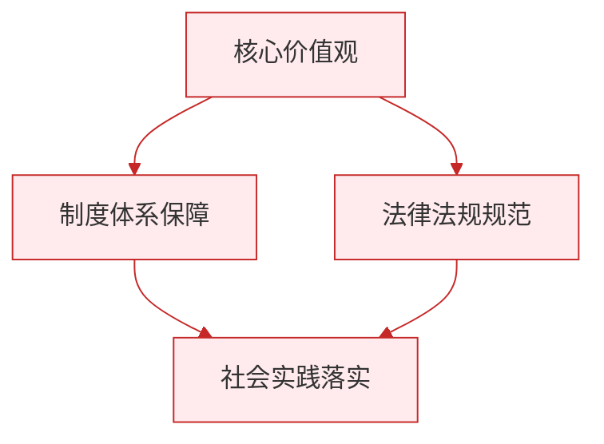

# 爱护身体

标签：#珍爱生命 #身体健康 #生活习惯

## 一、本知识点定位

统编版道德与法治七年级上册 **第三单元 珍爱我们的生命 第十课 保持身心健康 第一框「爱护身体」**。本框讲为什么要爱护身体、怎样养成健康的生活方式。

## 二、核心观点

1. **身体是我们生命活动的根基**，爱护身体是珍爱生命的基本要求。
2. 爱护身体，需要**关注自己的身体状况**，重视体检，有病及时就医，不讳疾忌医。
3. 爱护身体，需要**养成健康的生活方式**：合理作息、均衡饮食、加强锻炼、讲究卫生。
4. 要**杜绝不良嗜好**，远离烟酒，拒绝毒品，防止沉迷网络。
5. 爱护身体不仅是对自己负责，也是**对家人和社会负责**的表现。

## 三、知识梳理

### 1. 为什么要爱护身体（为什么）

- 身体是生命的物质载体，没有健康的身体，学习、生活和梦想都无从谈起。
- 初中阶段是身体发育的关键期，此时打下的健康基础影响一生。
- 我们的身体也牵动着父母家人的心，爱护身体是孝亲的表现。

### 2. 怎样关注身体状况（怎么做一）

- 学会觉察身体发出的信号，如长期疲劳、视力下降、体重异常。
- 定期体检，发现问题及时告诉家长并就医。
- 科学认识身体发育中的变化，不焦虑、不隐瞒。

### 3. 怎样养成健康生活方式（怎么做二）

- **合理作息**：保证充足睡眠，不熬夜；劳逸结合，课间远眺放松眼睛。
- **均衡饮食**：一日三餐规律，不挑食、不暴饮暴食，少吃高糖高油零食。
- **坚持锻炼**：每天进行体育运动，认真上体育课，课余多到户外活动。
- **拒绝不良嗜好**：不吸烟、不喝酒、坚决拒绝毒品；控制电子产品使用时间，防止沉迷网络。

## 四、重要概念

| 术语 | 定义 |
|---|---|
| 健康的生活方式 | 有益于身体健康的作息、饮食、锻炼、卫生等生活习惯 |
| 讳疾忌医 | 隐瞒疾病、不愿就医的错误做法 |
| 不良嗜好 | 吸烟、酗酒、沉迷网络等损害健康的习惯 |
| 劳逸结合 | 学习与休息合理搭配，保持身心状态良好 |

## 五、联系生活

小昊迷上了手机游戏，经常熬夜到深夜，早上上课犯困，视力也从1.0降到了0.6。在父母和老师帮助下，他制定了作息表：晚上十点前睡觉，每天放学打半小时篮球，周末使用电子产品不超过一小时。一个学期后，他上课精神多了，体育成绩也提高了。健康的身体，来自每天的好习惯。

## 六、背记要点

1. 身体是我们生命活动的根基。
2. 爱护身体要关注身体状况，重视体检，有病及时就医。
3. 爱护身体要养成健康的生活方式。
4. 健康生活方式包括：合理作息、均衡饮食、坚持锻炼、讲究卫生。
5. 要远离烟酒、拒绝毒品、防止沉迷网络。
6. 爱护身体是对自己负责，也是对家人和社会负责。

## 七、自测小题

1. 身体是我们生命活动的______。
2. 有病不肯就医、隐瞒病情，这种做法叫______忌医。
3. 下列属于健康生活方式的是（A. 熬夜刷题 B. 每天坚持体育锻炼 C. 用零食代替正餐）。
4. 同学递给你一支烟说"尝尝没关系"，你应该（A. 碍于面子接受 B. 坚决拒绝 C. 先收下再扔掉）。
5. 判断：爱护身体只是自己的私事，与他人无关。（对/错）
6. 简答：怎样爱护自己的身体？

**答案**：1. 根基 2. 讳疾 3. B 4. B 5. 错（身体健康也牵动家人，是对家人和社会负责的表现）
6. 答题要点：①关注身体状况，重视体检，有病及时就医；②养成健康的生活方式：合理作息、均衡饮食、坚持锻炼、讲究卫生；③杜绝不良嗜好，远离烟酒、拒绝毒品、防止沉迷网络。

相关：[[滋养心灵]] ｜ [[认识生命]]

### 政治理论与逻辑框架

