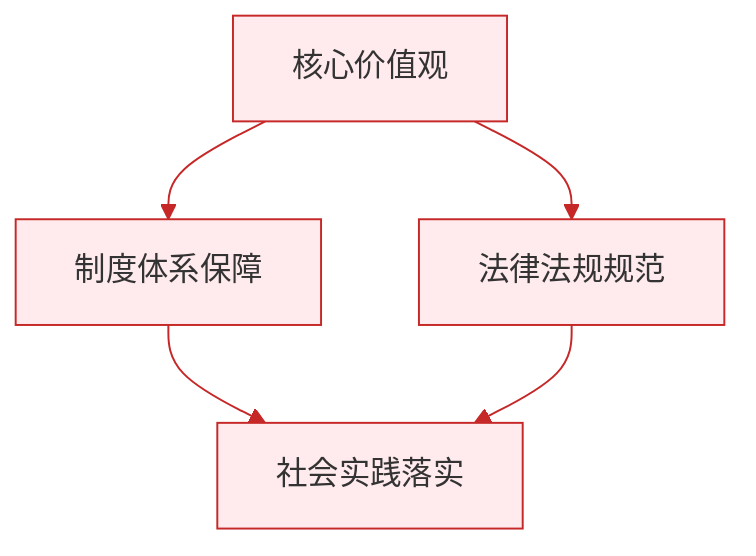

# 滋养心灵

标签：#珍爱生命 #心理健康 #情绪调节

## 一、本知识点定位

统编版道德与法治七年级上册 **第三单元 珍爱我们的生命 第十课 保持身心健康 第二框「滋养心灵」**。本框讲心理健康的重要性，以及怎样保持心理健康、丰富精神世界。

## 二、核心观点

1. 生命的健康既包括身体健康，也包括**心理健康**，身心健康相互影响、缺一不可。
2. 滋养心灵，需要**保持良好的心态**，学会正确对待学习和生活中的压力与挫折。
3. 滋养心灵，需要**学会调节情绪**，做情绪的主人。
4. 滋养心灵，需要**丰富精神世界**：阅读、艺术、运动、亲近自然都能滋养我们的心灵。
5. 遇到自己难以排解的心理困扰时，要**主动寻求帮助**，向父母、老师、心理辅导员倾诉，必要时寻求专业帮助。

## 三、知识梳理

### 1. 什么是心理健康（是什么）

- 心理健康表现为：情绪稳定积极、能正确认识自己、人际关系和谐、能适应环境变化。
- 心理健康与身体健康相互影响：长期焦虑会影响身体，坚持锻炼也能改善心情。

### 2. 为什么要滋养心灵（为什么）

- 初中阶段学习压力增大、身心变化明显，容易出现烦恼与困扰。
- 心理问题如不及时疏导，会影响学习、交往和身体健康。
- 健康的心灵让我们更从容地面对成长中的风雨，感受生命的美好。

### 3. 怎样滋养心灵（怎么做）

- **正确对待压力与挫折**：把压力看作成长的动力，把挫折当作锻炼的机会。
- **学会调节情绪**：可以用倾诉、运动、听音乐、写日记、深呼吸等方法排解不良情绪。
- **丰富精神世界**：多读好书、欣赏艺术、参加文体活动、走进大自然。
- **主动求助**：心理困扰长期得不到缓解时，及时向父母、老师或专业人员求助；求助不是软弱，而是智慧和勇气。

## 四、重要概念

| 术语 | 定义 |
|---|---|
| 心理健康 | 情绪积极稳定、认知正确、人际和谐、适应良好的心理状态 |
| 情绪调节 | 用合理方式排解不良情绪、保持良好心态的方法 |
| 精神世界 | 人的思想、情感、志趣等内在生活，需要不断充实滋养 |
| 心理求助 | 遇到难以自行排解的心理困扰时向他人或专业机构寻求帮助 |

## 五、联系生活

期中考试失利后，小玥一连几天闷闷不乐，不想说话。她试着把烦恼写进日记，又和好朋友跑了两圈步，心里轻松了不少。回家后她把心事告诉了妈妈，妈妈帮她分析了失分原因。她还借了一本喜欢的小说调剂心情。一周后，她重新制定了复习计划。倾诉、运动、阅读——这些都是滋养心灵的好办法。

## 六、背记要点

1. 生命的健康包括身体健康和心理健康。
2. 身心健康相互影响、缺一不可。
3. 滋养心灵要保持良好心态，正确对待压力与挫折。
4. 要学会调节情绪，做情绪的主人。
5. 调节情绪的方法：倾诉、运动、听音乐、写日记等。
6. 阅读、艺术、亲近自然可以丰富精神世界。
7. 心理困扰难以排解时，要主动寻求帮助，求助是智慧和勇气的表现。

## 七、自测小题

1. 生命的健康既包括身体健康，也包括______健康。
2. 调节情绪的常用方法有倾诉、______、听音乐、写日记等。
3. 心理困扰长期无法排解时，正确做法是（A. 憋在心里 B. 主动向父母、老师或专业人员求助 C. 上网发泄）。
4. 判断：向心理老师求助说明一个人心理有毛病，很丢人。（对/错）
5. 判断：只要身体健康，心理状态无所谓。（对/错）
6. 简答：怎样滋养自己的心灵？

**答案**：1. 心理 2. 运动 3. B 4. 错（主动求助是智慧和勇气的表现） 5. 错（身心健康相互影响、缺一不可）
6. 答题要点：①保持良好心态，正确对待压力与挫折；②学会调节情绪，用倾诉、运动等合理方式排解不良情绪；③丰富精神世界，多阅读、亲近自然、参加文体活动；④难以自行排解时主动寻求帮助。

相关：[[爱护身体]] ｜ [[拥有积极的人生态度]]

### 政治理论与逻辑框架

