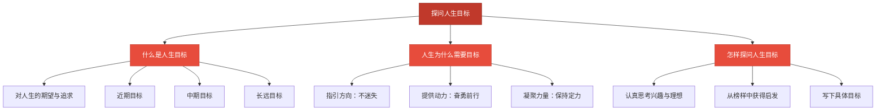

# 探问人生目标

标签：#追求美好人生 #人生目标 #人生意义

## 一、本知识点定位

统编版道德与法治七年级上册 **第四单元 追求美好人生 第十一课 确立人生目标 第一框「探问人生目标」**。本框讲什么是人生目标、人生目标对人生的重要意义。

## 二、核心观点

1. **人生目标是人生的航标**，指引人生的方向。
2. 人生目标是人们**对人生的期望**，反映了一个人对"想过什么样的生活、成为什么样的人"的思考。
3. 人生目标**激励我们奋勇前行**：有了目标，就有了前进的动力，就能在困难面前坚持不懈。
4. 没有目标的人生容易迷失方向、随波逐流。
5. 人生目标有**长远与短期**、**个人与社会**之分，不同的人生目标会带来不同的人生道路。
6. 探问人生目标，就是思考"我要到哪里去"，这是每个人成长中必须回答的问题。

## 三、知识梳理

### 1. 什么是人生目标（是什么）

- 人生目标是人们对自己人生的期望与追求，回答"成为什么样的人、过什么样的生活"。
- 人生目标可以分层次：近期目标（如学好本学期功课）、中期目标（如考上理想学校）、长远目标（如从事热爱的事业、报效祖国）。

### 2. 为什么人生需要目标（为什么）

- **指引方向**：目标像航标和灯塔，让我们知道往哪里走，不至于迷失。
- **提供动力**：目标激发热情，激励我们奋勇前行、不断超越自己。
- **凝聚力量**：面对困难和诱惑时，目标帮助我们保持定力、坚持到底。

### 3. 怎样探问自己的人生目标（怎么做）

- 认真思考：我的兴趣是什么？我擅长什么？我想成为什么样的人？
- 从榜样中获得启发：了解优秀人物确立目标、追求理想的经历。
- 把思考落到纸面：尝试写下自己的近期、中期和长远目标。

## 四、重要概念

| 术语 | 定义 |
|---|---|
| 人生目标 | 人们对自己人生的期望与追求，是人生的航标 |
| 近期目标 | 较短时间内要实现的目标 |
| 长远目标 | 指向人生较长阶段甚至一生的追求 |
| 随波逐流 | 没有目标和主见，跟着环境漂移的生活状态 |

## 五、联系生活

班会课上，老师让大家写"我的人生目标"。小舟一开始只写了"考个好高中"，老师引导他继续想：考上好高中之后呢？小舟想起自己喜欢生物、关心环保，补充写道："将来学习生态专业，参与环境保护。"从此他上生物课格外投入，还加入了学校的环保社团。目标一旦清晰，脚步就更有力量。

## 六、背记要点

1. 人生目标是人生的航标，指引人生的方向。
2. 人生目标反映人们对人生的期望。
3. 人生目标激励我们奋勇前行。
4. 没有目标的人生容易迷失方向、随波逐流。
5. 人生目标有近期、中期、长远之分。
6. 探问人生目标是每个人成长中必须思考的问题。

## 七、自测小题

1. 人生目标是人生的______，指引人生的方向。
2. 人生目标反映了人们对人生的______。
3. "这学期数学达到优秀"属于（A. 长远目标 B. 近期目标 C. 空想）。
4. 判断：初中生年纪还小，不需要思考人生目标。（对/错）
5. 没有人生目标的人容易（A. 专注前行 B. 迷失方向、随波逐流 C. 更加自由幸福）。
6. 简答：人生目标对我们有什么重要意义？

**答案**：1. 航标 2. 期望 3. B 4. 错（探问人生目标是成长必修课，宜早思考） 5. B
6. 答题要点：①人生目标指引人生的方向，使我们不迷失；②人生目标激励我们奋勇前行，为人生提供动力；③目标帮助我们在困难和诱惑面前保持定力、坚持不懈。

相关：[[树立正确的人生目标]] ｜ [[规划初中生活]] ｜ [[做有梦想的少年]]
