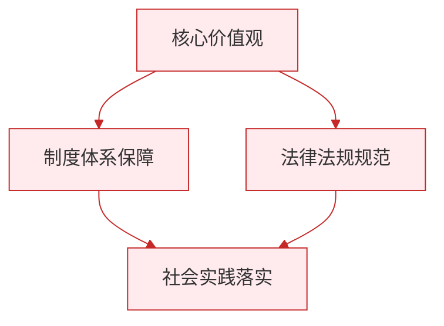

# 树立正确的人生目标

标签：#追求美好人生 #人生目标 #个人与社会

## 一、本知识点定位

统编版道德与法治七年级上册 **第四单元 追求美好人生 第十一课 确立人生目标 第二框「树立正确的人生目标」**。本框讲什么样的人生目标是正确的、怎样树立正确的人生目标。

## 二、核心观点

1. 正确的人生目标，要**从自身实际出发**，符合自己的兴趣、能力和条件。
2. 正确的人生目标，要**与国家、民族和人民的利益相结合**，把个人追求融入社会发展之中。
3. 一个人的人生目标只有**同国家的前途、民族的命运、人民的幸福结合在一起**，才更有意义和价值。
4. 树立人生目标后，要**将目标细化为切实可行的计划**，并付诸行动、久久为功。
5. 人生目标不是一成不变的，要**根据实际情况适时调整**，但方向要始终向上向善。

## 三、知识梳理

### 1. 什么样的人生目标是正确的（是什么）

- 立足实际：目标要与自身条件相符，经过努力可以实现，而不是好高骛远的空想。
- 服务社会：目标不只为自己，还应有益于他人、社会和国家。
- 向上向善：目标应体现正确的价值追求，而不是唯利是图、损人利己。

### 2. 为什么个人目标要与国家社会相结合（为什么）

- 个人与国家、社会息息相关，个人的成长离不开时代提供的舞台。
- 把小我融入大我，人生格局更开阔，人生价值更充分地实现。
- 一代代人为国家富强、民族复兴而奋斗的经历证明：与祖国共命运的人生更有意义。

### 3. 怎样实现人生目标（怎么做）

- **细化目标**：把人生目标分解为长远、中期、近期目标，一步步落实。
- **制订计划**：把目标变成具体的行动方案和时间安排。
- **持之以恒**：脚踏实地、久久为功，不因一时挫折放弃。
- **适时调整**：情况变化时合理调整目标和路径，保持前进方向。

## 四、重要概念

| 术语 | 定义 |
|---|---|
| 正确的人生目标 | 从自身实际出发、与国家民族人民利益相结合的目标 |
| 小我与大我 | 个人追求（小我）与国家社会利益（大我）的关系 |
| 久久为功 | 长期坚持、持续努力，不急于求成 |
| 好高骛远 | 目标脱离实际、一味贪大求高的错误倾向 |

## 五、联系生活

小雯擅长写作，最初的目标只是"当个有名的作家赚稿费"。学了本课后她想：文字还可以温暖人心、记录时代。她把目标调整为"用文字讲好身边的故事"，先从班级公众号的小记者做起，报道校园里的好人好事。目标接了地气，又连着他人与社会，她写作的劲头更足了。

## 六、背记要点

1. 正确的人生目标要从自身实际出发。
2. 正确的人生目标要与国家、民族和人民的利益相结合。
3. 个人目标同国家前途、民族命运结合在一起才更有意义和价值。
4. 实现目标要把它细化为切实可行的计划。
5. 实现目标要脚踏实地、久久为功。
6. 人生目标可以根据实际情况适时调整。

## 七、自测小题

1. 树立人生目标，要从自身______出发。
2. 个人的人生目标只有同国家的前途、民族的命运、人民的幸福______在一起，才更有意义。
3. "目标定得远远超出自己能力，从不考虑现实"属于（A. 志向远大 B. 好高骛远 C. 脚踏实地）。
4. 判断：人生目标一旦确立，无论情况怎样变化都绝不能调整。（对/错）
5. 实现人生目标需要（A. 空想等待 B. 细化目标、制订计划、坚持行动 C. 全靠运气）。
6. 简答：怎样树立正确的人生目标？

**答案**：1. 实际 2. 结合 3. B 4. 错（可根据实际适时调整，但方向要向上向善） 5. B
6. 答题要点：①从自身实际出发，符合自己的兴趣、能力和条件；②与国家、民族和人民的利益相结合，把个人追求融入社会发展；③把目标细化为切实可行的计划，付诸行动、久久为功；④根据实际情况适时调整。

相关：[[探问人生目标]] ｜ [[在奉献中成就精彩人生]]

### 政治理论与逻辑框架

