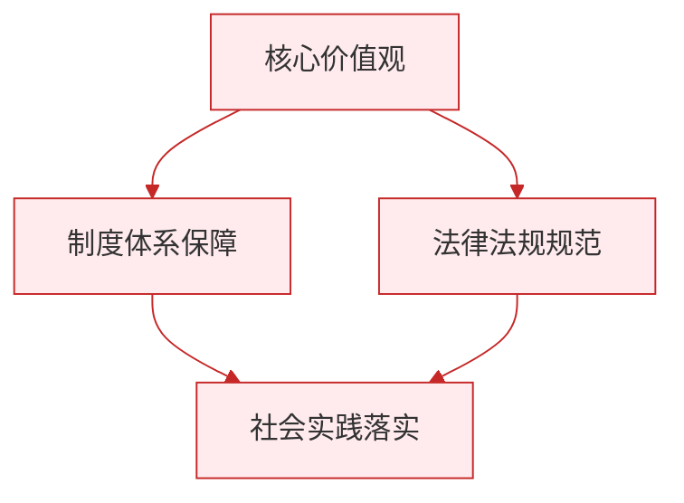

# 正确对待顺境和逆境

标签：#追求美好人生 #顺境逆境 #挫折

## 一、本知识点定位

统编版道德与法治七年级上册 **第四单元 追求美好人生 第十二课 端正人生态度 第二框「正确对待顺境和逆境」**。本框讲人生中顺境与逆境的辩证关系，以及身处不同境遇时应有的态度。

## 二、核心观点

1. 人生的旅途不会一帆风顺，**顺境和逆境都是人生的境遇**，每个人都可能经历。
2. 身处顺境时，要**居安思危、戒骄戒躁**，珍惜好条件，不沉溺于安逸。
3. 身处逆境时，要**冷静思考、从容面对**，积蓄力量、迎难而上。
4. 逆境可以**磨砺意志**，孕育成功的因素；能否变逆境为成长的阶梯，关键在于我们的态度。
5. 顺境和逆境**可以相互转化**：顺境中大意可能陷入困境，逆境中奋起可能迎来转机。
6. 无论顺境还是逆境，都要保持积极的人生态度，掌握人生的主动。

## 三、知识梳理

### 1. 顺境与逆境是什么（是什么）

- 顺境：条件有利、进展顺利的境遇。
- 逆境：遭遇困难、挫折、不利条件的境遇。
- 二者都是人生的组成部分，交替出现，不以人的意志为转移。

### 2. 为什么要正确对待顺境和逆境（为什么）

- 顺境中骄傲自满、贪图安逸，优势会变成劣势。
- 逆境中一蹶不振，困难会压垮人；正确面对，逆境能锻炼人、成就人。
- 顺境和逆境可以相互转化，态度决定转化的方向。

### 3. 怎样对待顺境和逆境（怎么做）

- **顺境中**：珍惜机遇，乘势而上；居安思危，戒骄戒躁，不放松对自己的要求。
- **逆境中**：不怨天尤人，冷静分析处境；调整心态，从容应对；把挫折当作磨炼，积蓄力量、迎难而上。
- **总的态度**：胜不骄、败不馁，始终保持积极向上的人生态度。

## 四、重要概念

| 术语 | 定义 |
|---|---|
| 顺境 | 条件有利、进展顺利的人生境遇 |
| 逆境 | 遭遇困难挫折、条件不利的人生境遇 |
| 居安思危 | 处在顺利安稳的环境中要想到可能出现的危难 |
| 挫折 | 人们在活动中遇到的阻碍、失利和失败 |

## 五、联系生活

小骏小学时成绩拔尖，进入初中后第一次月考只排中游。他一度想"躺平"，后来在老师帮助下分析原因：过去靠聪明不复习的老办法行不通了。他调整方法、认真订正错题，成绩逐步回升。曾经的顺境让他放松了要求，而这次"逆境"反倒教会了他科学的学习方法——境遇本身不决定人生，态度才决定。

## 六、背记要点

1. 人生不会一帆风顺，顺境和逆境都是人生的境遇。
2. 顺境中要居安思危、戒骄戒躁。
3. 逆境中要冷静思考、从容面对、迎难而上。
4. 逆境可以磨砺意志，孕育成功的因素。
5. 顺境和逆境可以相互转化。
6. 无论顺境逆境，都要保持积极的人生态度。

## 七、自测小题

1. 身处顺境时，要居安思危、戒骄______。
2. 逆境可以磨砺人的______，孕育成功的因素。
3. "生于忧患，死于安乐"提醒我们（A. 逆境必然失败 B. 顺境中要有忧患意识 C. 只有逆境才有价值）。
4. 考试失利后，正确的做法是（A. 一蹶不振 B. 冷静分析原因，调整方法再出发 C. 抱怨题目太难）。
5. 判断：顺境对人生有利，逆境对人生只有坏处。（对/错）
6. 简答：怎样正确对待顺境和逆境？

**答案**：1. 戒躁 2. 意志 3. B 4. B 5. 错（正确面对的逆境能磨砺意志、促进成长，二者还可相互转化）
6. 答题要点：①顺境中珍惜机遇、乘势而上，同时居安思危、戒骄戒躁；②逆境中不怨天尤人，冷静分析、从容面对，把挫折当作磨炼，迎难而上；③认识顺境逆境可以相互转化，始终保持积极的人生态度。

相关：[[拥有积极的人生态度]] ｜ [[滋养心灵]]

### 政治理论与逻辑框架

