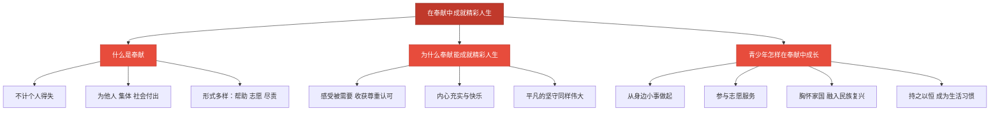

# 在奉献中成就精彩人生

标签：#追求美好人生 #奉献 #服务社会

## 一、本知识点定位

统编版道德与法治七年级上册 **第四单元 追求美好人生 第十三课 实现人生价值 第二框「在奉献中成就精彩人生」**。这是整册书的最后一框，讲奉献的意义，以及怎样在服务他人、奉献社会中成就精彩人生。

## 二、核心观点

1. **奉献让人生更加充盈、更有意义**；服务他人、奉献社会的人生是精彩的人生。
2. 个人与社会紧密相连，我们享受着他人和社会提供的种种给养，也应当**回馈他人和社会**。
3. 奉献不分大小：**平凡的坚守同样伟大**，在平凡的岗位上、日常的小事中都可以奉献。
4. 在奉献中，我们**赢得他人的尊重与认可**，收获内心的充实与快乐，实现生命的价值。
5. 青少年要**心怀天下、甘于奉献**，把个人的命运与国家、民族的命运联系在一起，让青春在奉献中焕发光彩。

## 三、知识梳理

### 1. 什么是奉献（是什么）

- 奉献是不计较个人得失，为他人、集体、社会付出的行为。
- 奉献的形式多样：帮助同学、参加志愿服务、在岗位上尽职尽责、为国家作贡献，都是奉献。

### 2. 为什么奉献能成就精彩人生（为什么）

- 人是社会的一员，我们的成长离不开他人和社会的付出，奉献是应有的回馈。
- 奉献让我们感受到自己被需要，收获尊重、认可与内心的幸福。
- 无数榜样人物证明：把自己奉献给崇高的事业，人生因奉献而精彩、因奉献而不朽。

### 3. 青少年怎样在奉献中成长（怎么做）

- **从身边做起**：帮助有困难的同学，主动为班级、学校做事。
- **参与志愿服务**：参加社区服务、公益活动，服务社会。
- **胸怀家国**：关心国家发展，把个人理想融入民族复兴的事业。
- **持之以恒**：奉献贵在坚持，把服务他人变成一种生活习惯。

## 四、重要概念

| 术语 | 定义 |
|---|---|
| 奉献 | 不计个人得失，为他人、集体和社会付出 |
| 志愿服务 | 自愿、无偿地服务他人和社会的公益活动 |
| 平凡的坚守 | 在普通岗位上长期尽责奉献，同样创造伟大价值 |
| 精彩人生 | 在服务他人、奉献社会中实现价值、充实而有意义的人生 |

## 五、联系生活

小悦参加了社区的"周末敬老"志愿队，每两周去养老院陪老人聊天、读报。起初她只是完成学校的实践任务，几次之后，老人们记住了她的名字，一见她来就露出笑容。她说："原来我小小的付出，能带给别人这么大的温暖，我自己心里也特别亮堂。"奉献带来的快乐，是索取无法替代的。

## 六、背记要点

1. 服务他人、奉献社会的人生是精彩的人生。
2. 我们享受他人和社会的给养，也应当回馈他人和社会。
3. 奉献不分大小，平凡的坚守同样伟大。
4. 在奉献中赢得尊重认可，收获内心的充实与快乐。
5. 青少年要心怀天下、甘于奉献。
6. 要把个人命运与国家、民族的命运联系在一起。
7. 让青春在奉献中焕发绚丽光彩。

## 七、自测小题

1. 服务他人、______社会的人生是精彩的人生。
2. 奉献不分大小，平凡的______同样伟大。
3. 下列属于奉献的是（A. 有偿替同学写作业 B. 参加社区志愿服务 C. 只做对自己有利的事）。
4. 判断：只有做出惊天动地的大事才算奉献。（对/错）
5. 判断：奉献只有付出没有收获，是吃亏的事。（对/错）
6. 简答：青少年怎样在奉献中成就精彩人生？

**答案**：1. 奉献 2. 坚守 3. B 4. 错（平凡岗位、日常小事中都可以奉献） 5. 错（奉献让我们赢得尊重、收获充实与快乐，实现人生价值）
6. 答题要点：①从身边小事做起，帮助他人、服务集体；②积极参加志愿服务和公益活动；③心怀天下，把个人理想融入国家、民族的事业；④持之以恒，让奉献成为生活习惯。

相关：[[在劳动中创造人生价值]] ｜ [[树立正确的人生目标]] ｜ [[共建美好集体]]
