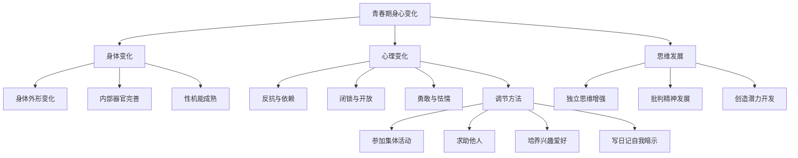

# 青春的邀约

标签：#青春期 #身体变化 #思维发展

## 一、本知识点定位

统编版道德与法治七年级下册 **第一单元 珍惜青春时光 第一课 青春的邀约**。本框帮助我们认识青春期的身心变化，正确对待青春期的成长烦恼，把握青春期思维发展的特点。

## 二、核心观点

1. 青春期是人一生中身体发育的**重要时期**，一般指人的发育过程中介于童年与成年之间的发育阶段。
2. 青春期的身体变化主要表现在三个方面：**身体外形的变化、内部器官的完善、性机能的成熟**。
3. 青春期的生理变化带来旺盛的生命力，使我们的身体充满能量，这是**正常的生理现象**。
4. 伴随身体变化，我们的**独立意识**不断增强，**思维水平**不断提高，进入思维发展的活跃期。
5. 青春期的矛盾心理是正常的，我们要学会**正确对待**，通过合理方式调节。

## 三、知识梳理

### 1. 青春期的身体变化（是什么）

- 身体外形的变化：身高、体重迅速增长，身体外形逐渐接近成人。
- 内部器官的完善：心脏、肺等内部器官功能日益增强。
- 性机能的成熟：第二性征出现，这是人体发育的自然规律。

### 2. 如何正确对待身体变化（怎么做）

- **正视身体变化**，欣然接受青春花蕾的绽放，不因变化而自卑或焦虑。
- 不嘲弄同伴的生理变化，尊重他人，这是我们应有的**道德修养**。
- 追求形体、仪表等外在美的同时，更要提高品德和文化修养，体现**内在美**。

### 3. 青春期的心理矛盾与调节

- 常见矛盾心理：反抗与依赖、闭锁与开放、勇敢与怯懦。
- 调节方法：参加集体活动、求助他人、培养兴趣爱好转移注意力、自我暗示、写日记倾诉等。

### 4. 青春期思维发展的特点

- **独立思维**：对未知事物充满好奇，敢于表达不同观点。
- **批判精神**：敢于对不合理的事情说"不"，敢于向权威挑战；批判要有质疑的勇气，也要有价值的建设性意见。
- **开发创造潜力**：敢于打破常规，追求生活的新奇与浪漫，通过劳动改变世界。

## 四、重要概念

| 术语 | 定义 |
|---|---|
| 青春期 | 介于童年与成年之间的发育阶段，身体发育的重要时期 |
| 第二性征 | 青春期性机能成熟过程中出现的男女身体特征差异 |
| 批判精神 | 敢于质疑、敢于表达不同观点，并提出建设性意见的思维品质 |
| 矛盾心理 | 青春期特有的反抗与依赖、闭锁与开放、勇敢与怯懦并存的心理状态 |

## 五、案例分析

小林进入初一后个子猛长，嗓音也变了，他一度不敢在课堂发言。班里个别同学嘲笑发育较早的女生，老师及时制止并召开班会。小林逐渐明白：身体变化是正常的生理现象，应当正视和接纳；嘲弄同伴的生理变化是不尊重他人的表现。这启示我们要以积极心态迎接青春期，尊重自己也尊重他人。

## 六、背记要点

1. 青春期是人一生中身体发育的重要时期。
2. 身体变化三表现：身体外形变化、内部器官完善、性机能成熟。
3. 对身体变化：正视、接纳，不自卑；不嘲弄他人的生理变化。
4. 青春期矛盾心理正常，可通过参加集体活动、求助他人等方式调节。
5. 青春期思维特点：独立意识增强、批判精神发展、创造潜力有待开发。
6. 批判既要有质疑的勇气，也要有建设性意见。

## 七、自测小题

1. 青春期身体变化主要表现在______、______、______三个方面。
2. 判断：同学发育比别人早，我们可以拿来开玩笑活跃气氛。（对/错）
3. 青春期思维的批判性要求我们（A. 否定一切 B. 有质疑勇气并提建设性意见 C. 服从权威）。
4. 简答：怎样正确对待青春期的矛盾心理？

**答案**：1. 身体外形的变化；内部器官的完善；性机能的成熟 2. 错（嘲弄他人生理变化是不尊重人的表现） 3. B
4. 答题要点：①认识到矛盾心理是正常现象；②参加集体活动，在集体的温暖中放松自己；③求助他人，学习化解烦恼的方法；④培养兴趣爱好转移注意力；⑤通过写日记、自我暗示等方式进行自我调节。

相关：[[男生女生]] ｜ [[揭开情绪的面纱]] ｜ [[认识自己]]
