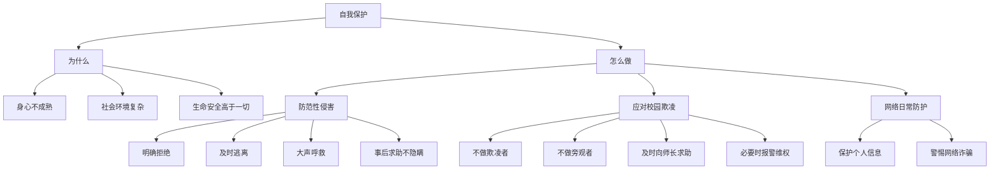

# 学会自我保护

标签：#自我保护 #防性侵 #依法维权

## 一、本知识点定位

统编版道德与法治七年级下册 **第一单元 珍惜青春时光 第二课「学会自我保护」**。青春期的我们渴望独立又缺乏经验，容易受到侵害，本框帮助我们增强自我保护意识、掌握自我保护的方法。

## 二、核心观点

1. 青春期的我们身心尚未成熟，社会经验不足，**容易受到伤害**，需要增强自我保护意识。
2. 自我保护既要防范**来自自然界的伤害**，也要防范**来自社会的侵害**（如欺凌、性侵害、网络诈骗等）。
3. 面对侵害，要**依靠智慧**保护自己，及时求助，必要时**依法维权**。
4. 未成年人受到法律的**特殊保护**，《中华人民共和国未成年人保护法》为我们提供了法律保障。
5. 增强安全意识、提高辨别能力，是自我保护的**前提**。

## 三、知识梳理

### 1. 为什么要学会自我保护（为什么）

- 青春期身心发育尚不成熟，辨别是非能力和自我控制能力有限。
- 社会环境复杂，存在校园欺凌、性侵害、网络陷阱等潜在危险。
- 生命安全高于一切，学会自我保护是健康成长的必修课。

### 2. 防范性侵害（怎么做）

- 认识身体的隐私部位，任何人不得随意触碰。
- 警惕熟人和陌生人的不当要求，不单独前往偏僻场所。
- 遭遇侵害时，明确拒绝、及时逃离、大声呼救。
- 事后及时告诉家长、老师或报警，**不自责、不隐瞒**，保留证据。

### 3. 应对校园欺凌

- 不做欺凌者，不做冷漠的旁观者，也不忍气吞声做沉默的受害者。
- 保持冷静，机智求助，及时向老师、家长反映。
- 必要时拨打110报警或寻求法律帮助。

### 4. 网络与日常生活中的自我保护

- 保护个人信息，不向陌生人透露家庭住址、电话等。
- 不轻信网络"好友"，警惕网络诈骗与不良信息。
- 外出注意交通安全，遇到自然灾害掌握基本避险技能。

## 四、法律条文链接

- 《中华人民共和国未成年人保护法》规定：国家、社会、学校和家庭应当对未成年人进行理想教育、道德教育……保障未成年人的合法权益。
- 《中华人民共和国刑法》对性侵害未成年人的犯罪行为规定了严厉的刑罚。
- 《中华人民共和国治安管理处罚法》对殴打、侮辱他人等行为规定了处罚。

## 五、案例分析

初一学生小婷放学路上被高年级学生拦截索要财物并被威胁"不许告诉别人"。小婷表面答应，脱身后立即告诉班主任并由学校报警处理。小婷的做法启示我们：面对侵害要保持冷静，依靠智慧脱身；不忍气吞声，及时向老师、家长求助；学会运用法律武器维护自身合法权益。

## 六、背记要点

1. 青春期身心不成熟、经验不足，需要增强自我保护意识。
2. 面对侵害：明确拒绝、及时逃离、大声呼救、事后求助。
3. 遭遇性侵害不自责、不隐瞒，保留证据，及时报警。
4. 面对欺凌：不做欺凌者、旁观者，也不做沉默的受害者。
5. 保护个人信息，警惕网络陷阱。
6. 未成年人保护法等法律为我们提供特殊保护，要学会依法维权。

## 七、自测小题

1. 面对不法侵害，正确的做法是明确拒绝、______、______，事后及时求助。
2. 判断：遭遇性侵害后为了面子应该保持沉默。（对/错）
3. 为未成年人提供专门法律保护的法律是（A. 民法典 B. 未成年人保护法 C. 教育法）。
4. 简答：面对校园欺凌，我们应该怎么做？

**答案**：1. 及时逃离；大声呼救 2. 错（应及时告诉家长、老师或报警，不自责不隐瞒） 3. B
4. 答题要点：①保持冷静，依靠智慧机智应对；②不做欺凌者，不做冷漠的旁观者，不忍气吞声；③及时向老师、家长求助；④必要时报警，依法维护自身合法权益。

相关：[[青春的邀约]] ｜ [[增强安全意识]] ｜ [[提高防护能力]] ｜ [[法律保障生活]]
