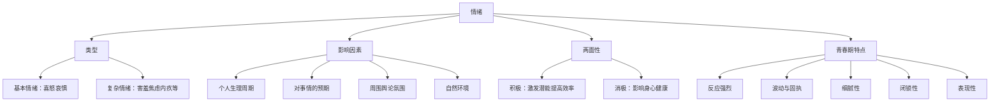

# 揭开情绪的面纱

标签：#情绪 #青春期心理 #情绪特点

## 一、本知识点定位

统编版道德与法治七年级下册 **第一单元 珍惜青春时光 第三课「揭开情绪的面纱」**。本框帮助我们认识情绪的基本类型、影响情绪的因素以及青春期情绪的特点。

## 二、核心观点

1. 人的情绪是**复杂多样**的，基本情绪包括**喜、怒、哀、惧**，还有害羞、焦虑、厌恶、内疚等复杂情绪。
2. 情绪受多方面因素影响：**个人的生理周期、对某件事情的预期、周围的舆论氛围、自然环境**等。
3. 情绪作用具有**两面性**：积极情绪激励我们克服困难，消极情绪可能危害身心健康。
4. 青春期的情绪特点：**反应强烈、波动与固执、细腻性、闭锁性、表现性**。
5. 情绪没有绝对的好坏之分，关键在于**如何对待和表达**。

## 三、知识梳理

### 1. 情绪的类型（是什么）

- 基本情绪：喜、怒、哀、惧（人人都有、与生俱来）。
- 复杂情绪：害羞、焦虑、厌恶、内疚等（在基本情绪基础上发展而来）。
- 同一情境下，不同的人可能产生不同的情绪反应。

### 2. 影响情绪的因素（为什么）

- 个人的生理周期（如疲劳时易烦躁）。
- 对某件事情的预期（期望越高，落差带来的失落可能越大）。
- 周围的舆论氛围（他人评价影响心情）。
- 自然环境（天气、季节的变化）。

### 3. 情绪的作用（两面性）

- 积极作用：情绪是人的正常心理活动，可以激发潜能、提高效率、促进健康。
- 消极作用：持续的负面情绪会削弱判断力，影响学习、生活和人际关系，损害身心健康。

### 4. 青春期情绪的特点

- **反应强烈**：容易冲动，喜怒形于色。
- **波动与固执**：情绪起伏大，有时又固执己见。
- **细腻性**：情感体验更加细致敏感。
- **闭锁性**：不轻易向他人吐露内心。
- **表现性**：情绪表现带有表演色彩，会顾及他人反应。

## 四、重要概念

| 术语 | 定义 |
|---|---|
| 基本情绪 | 喜、怒、哀、惧四种与生俱来的情绪 |
| 复杂情绪 | 在基本情绪基础上发展出的害羞、焦虑、内疚等情绪 |
| 情绪的两面性 | 情绪既能激励人，也可能危害身心健康 |
| 闭锁性 | 青春期不轻易向他人袒露内心情绪的特点 |

## 五、案例分析

考试成绩公布，小凯数学没考好，一整天闷闷不乐，上课也听不进去；同桌小李同样没考好，却分析错题原因，很快调整状态。同样的事件引发不同情绪反应，说明情绪与个人对事情的看法和预期有关；小凯若长期陷入低落情绪，会影响学习效率和身心健康，应学会调适情绪。

## 六、背记要点

1. 基本情绪：喜、怒、哀、惧；复杂情绪：害羞、焦虑、厌恶、内疚等。
2. 影响情绪的因素：生理周期、预期、舆论氛围、自然环境等。
3. 情绪具有两面性：既可激发潜能，也可能危害身心。
4. 青春期情绪特点：反应强烈、波动与固执、细腻性、闭锁性、表现性。
5. 情绪本身无好坏，关键在于如何对待与表达。

## 七、自测小题

1. 人的四种基本情绪是______、______、______、______。
2. 判断：消极情绪一无是处，必须彻底消灭。（对/错）
3. 小明不愿把心事告诉任何人，这体现青春期情绪的（A. 表现性 B. 闭锁性 C. 细腻性）。
4. 简答：影响情绪的因素有哪些？

**答案**：1. 喜；怒；哀；惧 2. 错（情绪有两面性，适度的焦虑等消极情绪也能催人努力，关键是合理调节） 3. B
4. 答题要点：①个人的生理周期；②对某件事情的预期；③周围的舆论氛围；④自然环境等。

相关：[[学会管理情绪]] ｜ [[品味美好情感]] ｜ [[青春的邀约]]
