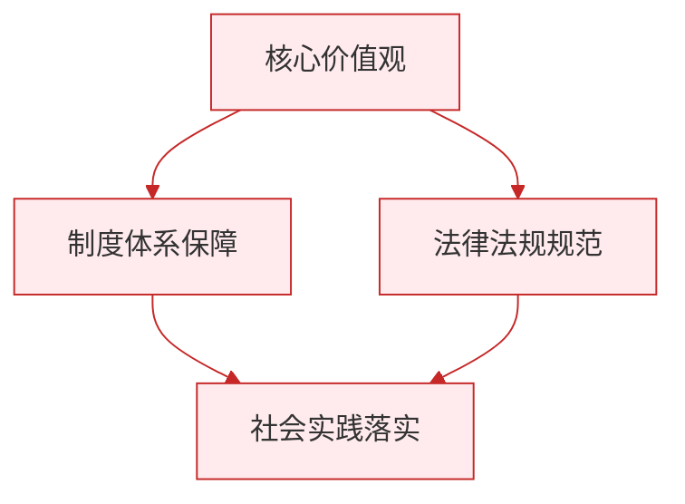

# 学会管理情绪

标签：#情绪调节 #情绪表达 #心理健康

## 一、本知识点定位

统编版道德与法治七年级下册 **第一单元 珍惜青春时光 第三课「学会管理情绪」**。在认识情绪的基础上，本框教我们恰当表达情绪、掌握调节情绪的方法，做情绪的主人。

## 二、核心观点

1. 情绪需要**恰当表达**：人与人之间的情绪会相互感染，情绪表达影响人际交往。
2. 表达情绪要考虑**场合、方式和分寸**，既尊重自己的感受，也顾及他人的感受。
3. 情绪是可以**调节和管理**的，我们可以成为情绪的主人。
4. 常用的情绪调节方法：**改变认知评价、转移注意、合理宣泄、放松训练**等。
5. 学会管理情绪，有助于我们**身心健康**和**人际和谐**。

## 三、知识梳理

### 1. 为什么要恰当表达情绪（为什么）

- 情绪会相互感染：一个人的情绪状态会影响周围的人。
- 恰当表达有利于沟通：既让他人了解自己的感受，也避免伤害他人。
- 任性发泄情绪可能破坏人际关系，压抑情绪则伤害自己。

### 2. 怎样恰当表达情绪（怎么做）

- 选择合适的**场合**：不在公共场合大发脾气。
- 采用恰当的**方式**：用语言说出感受，而不是摔东西、骂人。
- 把握**分寸**：既真实表达，又不过度渲染。
- 表达负面情绪时，可采用"我信息"表达法：说事实、讲感受、提希望。

### 3. 情绪调节的方法（重点）

- **改变认知评价**：换个角度看问题，如把考试失利看作查漏补缺的机会。
- **转移注意**：做运动、听音乐、看书，把注意力从消极情绪上移开。
- **合理宣泄**：向信任的人倾诉、写日记、适度哭泣、运动发泄。
- **放松训练**：深呼吸、肌肉放松、冥想等。

### 4. 帮助他人调节情绪

- 关注他人情绪变化，理解、接纳他人的感受。
- 用倾听、陪伴、劝导等方式帮助他人走出消极情绪。

## 四、重要概念

| 术语 | 定义 |
|---|---|
| 情绪感染 | 一个人的情绪状态影响周围人的心理现象 |
| 认知评价 | 通过改变对事情的看法来改变情绪反应 |
| 合理宣泄 | 在不伤害自己和他人的前提下释放情绪 |
| 放松训练 | 通过呼吸、冥想等方式使身心放松的方法 |

## 五、案例分析

小强被同学误会拿了他的笔，非常委屈愤怒，想当场翻脸。他深吸几口气让自己冷静（放松训练），然后平静地说明情况，并建议一起找一找，最后笔在课桌缝里被找到，两人和好如初。小强先调节情绪再恰当表达，避免了冲突升级，说明管理情绪能让我们更好地解决问题、维护友谊。

## 六、背记要点

1. 情绪会相互感染，需要恰当表达。
2. 表达情绪要注意场合、方式、分寸。
3. 情绪调节四法：改变认知评价、转移注意、合理宣泄、放松训练。
4. 合理宣泄不等于任性发泄，不能伤害自己和他人。
5. 我们要学会关心他人情绪，帮助他人调节情绪。
6. 做情绪的主人，有利于身心健康和人际和谐。

## 七、自测小题

1. 情绪调节的方法主要有改变认知评价、______、______、放松训练等。
2. 判断：心情不好时摔东西、冲人发火也是一种合理宣泄。（对/错）
3. 把考试失利看作发现问题的机会，这运用了（A. 转移注意 B. 改变认知评价 C. 放松训练）。
4. 简答：为什么要学会恰当表达情绪？

**答案**：1. 转移注意；合理宣泄 2. 错（合理宣泄以不伤害自己和他人为前提） 3. B
4. 答题要点：①情绪会相互感染，影响周围的人；②恰当表达有利于人际沟通与交往；③任性发泄会伤害他人、破坏关系，一味压抑会损害身心健康。

相关：[[揭开情绪的面纱]] ｜ [[品味美好情感]] ｜ [[滋养心灵]]

### 政治理论与逻辑框架

