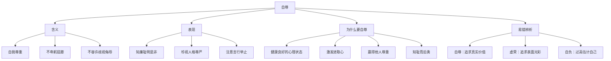

# 人须有自尊

标签：#自尊 #人格尊严 #知耻

## 一、本知识点定位

统编版道德与法治七年级下册 **第二单元 焕发青春活力 第四课「人须有自尊」**。本框帮助我们理解自尊的含义、表现和意义，认识自尊对青春成长的重要价值。

## 二、核心观点

1. 自尊即**自我尊重**，指既不向别人卑躬屈膝，也不允许别人歧视、侮辱自己。
2. 自尊是一种**健康良好的心理状态**，是人的基本心理需要。
3. 自尊的人**知廉耻、明是非**，"羞恶之心，义之端也"。
4. 自尊的人**积极向上**，追求美好的形象，维护自己的人格尊严。
5. 自尊能激发我们的**进取心**，是成就精彩人生的重要力量。

## 三、知识梳理

### 1. 什么是自尊（是什么）

- 自尊即自我尊重：尊重自己的人格，珍视自己的名誉。
- 两个"不"：不向别人卑躬屈膝；不允许别人歧视、侮辱自己。
- 自尊是人人都需要的基本心理需要。

### 2. 自尊的表现

- 注意自己的言行举止，维护良好形象。
- 知廉耻、明是非：做了错事感到惭愧，受到表扬感到光荣。
- 珍惜人格尊严，不做有损人格的事。

### 3. 为什么人须有自尊（为什么）

- 自尊是一种健康良好的心理状态，让我们保持积极的精神面貌。
- 自尊能激发进取心，促使我们不断完善自己。
- 有自尊的人才能赢得他人的尊重；一个人自尊自爱，才能自立自强。
- 知耻而后勇：知耻是自尊的重要表现，能促使我们改正错误、追求上进。

### 4. 自尊与虚荣、自负的区别（易错点）

- 自尊：实事求是地看待自己，追求真实的价值。
- 虚荣：追求表面的荣耀和光彩，是扭曲的自尊心。
- 自负：过高估计自己，看不起别人。

## 四、重要概念

| 术语 | 定义 |
|---|---|
| 自尊 | 自我尊重，不卑躬屈膝，也不容许他人歧视侮辱 |
| 人格尊严 | 人作为人应有的最起码的社会地位和受到他人尊重的权利 |
| 知耻 | 对自己不恰当行为感到羞愧，是自尊的重要表现 |
| 虚荣 | 追求表面光彩的扭曲的自尊心 |

## 五、案例分析

小华家庭条件一般，有同学嘲笑他穿旧球鞋。小华坦然回应："鞋子干净合脚就行，成绩和人品才是我在意的。"他学习刻苦，期末获得进步奖。小华的言行体现了自尊：不因他人嘲讽而自轻自贱，以积极进取维护自己的尊严；同时启示我们自尊不是攀比虚荣，而是珍视人格、追求真实的进步。

## 六、背记要点

1. 自尊即自我尊重：不卑躬屈膝，不容许歧视侮辱。
2. 自尊是健康良好的心理状态，是基本心理需要。
3. 自尊的人知廉耻、明是非。
4. "羞恶之心，义之端也"——知耻是自尊的重要表现。
5. 自尊激发进取心，促使我们完善自我。
6. 自尊不同于虚荣（追求表面光彩）和自负（过高估计自己）。

## 七、自测小题

1. 自尊即______，既不向别人卑躬屈膝，也不允许别人______、______自己。
2. 判断：为了面子借钱买名牌手机是自尊的表现。（对/错）
3. "羞恶之心，义之端也"说明自尊的人（A. 爱慕虚荣 B. 知廉耻明是非 C. 自高自大）。
4. 简答：为什么说人须有自尊？

**答案**：1. 自我尊重；歧视；侮辱 2. 错（这是虚荣，是扭曲的自尊心） 3. B
4. 答题要点：①自尊是健康良好的心理状态，是人的基本心理需要；②自尊使人知廉耻、明是非；③自尊激发进取心，促使我们积极向上、完善自己；④自尊自爱才能赢得他人尊重，成就精彩人生。

相关：[[做自尊的人]] ｜ [[人要有自信]] ｜ [[认识自己]]
