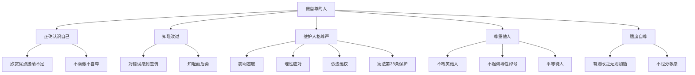

# 做自尊的人

标签：#自尊 #尊重他人 #维护尊严

## 一、本知识点定位

统编版道德与法治七年级下册 **第二单元 焕发青春活力 第四课「做自尊的人」**。在理解自尊含义的基础上，本框告诉我们怎样在生活中养成自尊、维护自尊、尊重他人。

## 二、核心观点

1. 做自尊的人，要**正确认识自己**，既看到优点也接纳不足，不自卑不自负。
2. 做自尊的人，要**知廉耻、明是非**，用实际行动纠正错误、追求上进。
3. 做自尊的人，要**自觉维护自己的人格尊严**，面对侮辱和歧视要依法维权。
4. 自尊的人**懂得尊重他人**：尊重他人才能赢得他人的尊重。
5. 做自尊的人，要**适度自尊**，正确对待他人的批评和议论，不过分敏感。

## 三、知识梳理

### 1. 正确认识自己（基础）

- 客观评价自己，欣赏自己的优点，接纳自己的不足。
- 不因长处而骄傲自负，不因短处而自卑自弃。
- 通过自我完善不断增强自尊的底气。

### 2. 知耻改过，积极向上

- 对不恰当的言行感到羞愧，及时改正。
- 把知耻转化为前进的动力，"知耻而后勇"。

### 3. 维护人格尊严（怎么做）

- 人格尊严不容侵犯：面对他人的侮辱、诽谤、歧视，要明确表明态度。
- 学会运用法律武器：我国法律规定公民的人格尊严受法律保护。
- 维护尊严的方式要合法、理性，不能以暴制暴。

### 4. 尊重他人

- 自尊的人不做有损他人人格的事：不嘲笑、不起侮辱性绰号、不揭人短处。
- 尊重他人的人格、习惯和选择，平等待人。
- 尊重是相互的：尊重他人就是尊重自己。

### 5. 适度自尊（易错点）

- 正确对待批评：有则改之，无则加勉。
- 不过分在意他人议论，避免因过度敏感而斤斤计较。

## 四、法律条文链接

- 《中华人民共和国宪法》第三十八条：中华人民共和国公民的人格尊严不受侵犯。禁止用任何方法对公民进行侮辱、诽谤和诬告陷害。
- 《中华人民共和国民法典》规定：民事主体享有名誉权、荣誉权、隐私权等人格权利。

## 五、案例分析

小明因体型偏胖被个别同学起侮辱性绰号，他先严肃表明"请尊重我"，对方仍不收敛，他便向班主任反映，学校对相关同学进行了批评教育。小明既没有忍气吞声，也没有动手报复，而是理性、合法地维护了自己的人格尊严。这告诉我们：维护自尊要有勇气表明态度，必要时寻求老师、学校或法律的帮助。

## 六、背记要点

1. 做自尊的人：正确认识自己、知耻改过、维护尊严、尊重他人、适度自尊。
2. 人格尊严不容侵犯，宪法明确保护公民人格尊严。
3. 面对侮辱歧视：表明态度、理性应对、依法维权。
4. 尊重他人才能赢得尊重；不给他人起侮辱性绰号。
5. 正确对待批评：有则改之，无则加勉。

## 七、自测小题

1. 我国______第三十八条规定，公民的人格尊严不受侵犯。
2. 判断：别人给我起侮辱性绰号，我就给他起一个更难听的。（对/错）
3. 同学善意指出我的错误，正确态度是（A. 恼羞成怒 B. 有则改之无则加勉 C. 置之不理）。
4. 简答：怎样做一个自尊的人？

**答案**：1. 宪法 2. 错（应理性合法维权，不能以牙还牙侵犯他人尊严） 3. B
4. 答题要点：①正确认识自己，不自卑不自负；②知廉耻明是非，知错就改；③自觉维护人格尊严，依法维权；④尊重他人，平等待人；⑤适度自尊，正确对待批评与议论。

相关：[[人须有自尊]] ｜ [[做自信的人]] ｜ [[法律保障生活]]
