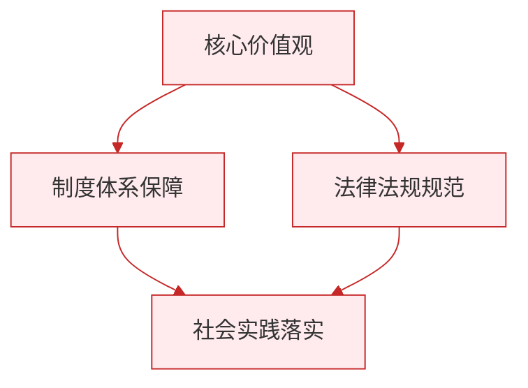

# 人要有自信

标签：#自信 #自信的力量 #青春活力

## 一、本知识点定位

统编版道德与法治七年级下册 **第二单元 焕发青春活力 第五课「人要有自信」**。本框帮助我们理解自信的含义与表现，认识自信对个人成长和国家民族发展的重要意义。

## 二、核心观点

1. 自信是对**自身力量的确信**，深信自己一定能做成某件事，实现所追求的目标。
2. 自信是**积极的心理品质**，让人充满激情与活力。
3. 自信让我们**充满活力**：有勇气交往与表达，有信心尝试与坚持，敢于面对困难与挑战。
4. 自信的人**乐观向上、积极进取**，能够展示优势、发掘潜能。
5. 自信不仅关乎个人，也关乎民族：**民族自信**是国家兴旺发达的精神支撑。

## 三、知识梳理

### 1. 什么是自信（是什么）

- 自信是对自身力量的确信，相信"我能行"。
- 自信基于对自己的正确认识：既了解自己的优势，也清楚自己的不足。
- 自信不等于自负（过高估计自己），也不同于自卑（过低评价自己）。

### 2. 自信的表现

- 交往中：大方得体、敢于表达自己的观点。
- 学习中：勇于尝试新事物，遇到难题不轻言放弃。
- 面对挑战：沉着冷静、从容应对。

### 3. 自信的作用（为什么）

- 自信让人充满激情：满怀信心与希望，保持乐观的人生态度。
- 自信激发潜能与活力：敢闯敢试，发挥出更好的水平。
- 自信使人获得成功：成功又进一步增强自信，形成良性循环。
- 自卑让人畏缩不前，自负使人盲目冒进，都不利于成长。

### 4. 自信与民族自信

- 个人自信汇聚成民族自信心与自豪感。
- 文化自信是更基础、更广泛、更深厚的自信。
- 新时代青少年要把个人自信融入实现中华民族伟大复兴的实践中。

## 四、重要概念

| 术语 | 定义 |
|---|---|
| 自信 | 对自身力量的确信，深信自己能实现追求的目标 |
| 自负 | 过高估计自己、看不起别人的心理 |
| 自卑 | 过低评价自己、轻视自己的心理 |
| 民族自信 | 一个民族对自身文化与发展前景的坚定信心 |

## 五、案例分析

学校英语演讲比赛报名时，小静担心口音被笑不敢报名。老师鼓励她："你平时朗读很有感情，试试才知道。"她认真准备、反复练习，最终获得二等奖，之后课堂发言也更积极了。这说明：自信让我们敢于尝试与坚持；在实践中获得成功体验，又会进一步增强自信，形成良性循环。

## 六、背记要点

1. 自信是对自身力量的确信。
2. 自信是积极的心理品质，让人充满激情与活力。
3. 自信的表现：敢于表达、勇于尝试、从容应对挑战。
4. 自信促成功，成功增自信（良性循环）。
5. 自信≠自负，自卑不可取。
6. 个人自信与民族自信相连，文化自信是更基础、更广泛、更深厚的自信。

## 七、自测小题

1. 自信是对______的确信，深信自己一定能做成某件事。
2. 判断：自信就是认为自己样样都比别人强。（对/错）
3. "我不行，肯定考不好"反映的心理是（A. 自信 B. 自负 C. 自卑）。
4. 简答：自信对我们的成长有什么作用？

**答案**：1. 自身力量 2. 错（那是自负；自信建立在正确认识自己的基础上） 3. C
4. 答题要点：①自信让人充满激情，保持乐观向上的人生态度；②自信让我们充满活力，敢于交往表达、勇于尝试坚持；③自信助我们发掘潜能、走向成功，形成良性循环；④自信也是民族精神的重要支撑。

相关：[[做自信的人]] ｜ [[人须有自尊]] ｜ [[人要自强]]

### 政治理论与逻辑框架

