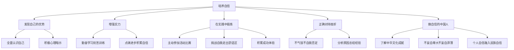

# 做自信的人

标签：#自信 #培养自信 #实践锻炼

## 一、本知识点定位

统编版道德与法治七年级下册 **第二单元 焕发青春活力 第五课「做自信的人」**。在认识自信重要性的基础上，本框告诉我们培养自信的具体方法和途径。

## 二、核心观点

1. 做自信的人，要**正确认识自己**，发现自己的优势和长处。
2. 自信要建立在**实力**的基础上：不断学习、增长才干，是自信最坚实的支撑。
3. 在**实践中挑战自己**：勇敢尝试，在克服困难中积累成功经验。
4. 正确面对**挫折与失败**：不因一时失利而否定自己。
5. 做自信的中国人：胸怀理想，**将个人自信融入民族自信**。

## 三、知识梳理

### 1. 发现自己的优势（基础）

- 全面客观地认识自己，善于发现自己的长处和潜能。
- 接纳自己的不足，扬长避短。
- 多给自己积极的心理暗示："我能行""我可以做得更好"。

### 2. 增强实力（关键）

- 自信的底气来自实力：知识、能力、经验的积累。
- 勤奋学习、刻苦训练，用真本领支撑自信心。
- 专注做好每一件小事，在点滴进步中积累自信。

### 3. 在实践中锻炼（途径）

- 勇于尝试：主动参加班级活动、比赛、社会实践。
- 挑战自我：走出舒适区，做以前不敢做的事。
- 积累成功体验：每一次小的成功都是自信的基石。

### 4. 正确对待挫折

- 失败时不气馁、不自我否定，分析原因、总结经验。
- 把挫折当作磨砺，愈挫愈勇。

### 5. 做自信的中国人

- 了解中华优秀传统文化和国家发展成就，增强民族自豪感。
- 把个人的自信自强与国家、民族的命运联系起来。
- 既不妄自尊大，也不妄自菲薄，以开放包容的心态面对世界。

## 四、重要概念

| 术语 | 定义 |
|---|---|
| 积极暗示 | 用正面语言鼓励自己、增强信心的心理方法 |
| 实力 | 支撑自信的知识、能力与经验的总和 |
| 成功体验 | 实践中获得的成功感受，是自信的重要来源 |
| 民族自豪感 | 对民族文化与成就的认同和骄傲 |

## 五、案例分析

小涛数学基础差，一度自暴自弃。老师帮他制定计划：每天弄懂三道基础题，每周整理一次错题。一学期后他从不及格提高到八十多分，主动举手发言的次数也多了。小涛的转变说明：自信要建立在实力基础上，通过点滴积累增强本领；在不断的进步和成功体验中，自信心会逐步建立起来。

## 六、背记要点

1. 做自信的人：认识优势、增强实力、实践锻炼、正确对待挫折。
2. 自信最坚实的基础是实力。
3. 积极的心理暗示有助于增强自信。
4. 在实践中挑战自我、积累成功体验。
5. 面对失败不自我否定，总结经验再出发。
6. 做自信的中国人：不妄自尊大，不妄自菲薄，把个人自信融入民族自信。

## 七、自测小题

1. 自信最坚实的基础是______。
2. 判断：培养自信只需每天对自己说"我最棒"就够了。（对/错）
3. 做自信的中国人，正确的态度是（A. 妄自尊大 B. 妄自菲薄 C. 既不妄自尊大也不妄自菲薄）。
4. 简答：怎样培养自信？

**答案**：1. 实力 2. 错（积极暗示有帮助，但自信更需要实力支撑和实践积累） 3. C
4. 答题要点：①正确认识自己，发现优势，接纳不足；②勤奋学习，增强实力；③积极参加实践活动，挑战自我，积累成功体验；④正确对待挫折，不轻易否定自己；⑤增强民族自豪感，做自信的中国人。

相关：[[人要有自信]] ｜ [[人要自强]] ｜ [[做更好的自己]]
