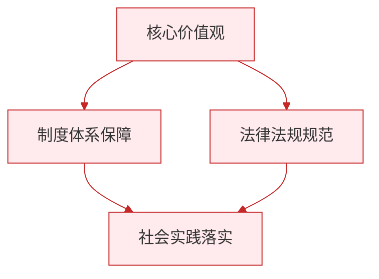

# 做自强不息的中国人

标签：#自强不息 #民族精神 #时代使命

## 一、本知识点定位

统编版道德与法治七年级下册 **第二单元 焕发青春活力 第六课「做自强不息的中国人」**。本框将个人自强上升到国家民族层面，引导我们把自强精神融入实现中华民族伟大复兴的实践。

## 二、核心观点

1. 自强不息是中华民族的**民族精神**的重要内容，深深融入中华民族的血脉。
2. 中华民族的发展史就是一部**自强不息的奋斗史**：从站起来、富起来到强起来。
3. 国家的强盛离不开每个人的自强：**个人命运与国家命运紧密相连**。
4. 新时代青少年要**以奋斗成就青春**，把个人理想融入国家发展。
5. 做自强不息的中国人，要**刻苦学习、锤炼品格、勇担使命**。

## 三、知识梳理

### 1. 自强不息的民族基因（是什么）

- "天行健，君子以自强不息"体现了中华民族的精神追求。
- 愚公移山、大禹治水、精卫填海等传说彰显自强不息精神。
- 历史上无数仁人志士在民族危难时挺身而出，救亡图存。

### 2. 自强不息的时代体现（为什么）

- 新中国成立以来："两弹一星"、载人航天、脱贫攻坚、科技自立自强。
- 无数普通劳动者、科学家、运动员用奋斗书写自强故事。
- 国家发展成就是全体中国人民自强不息、艰苦奋斗的结果。

### 3. 个人自强与国家发展的关系

- 个人是国家的一分子，个人的自强汇聚成国家的力量。
- 国家的发展为个人成长提供广阔舞台。
- 实现中华民族伟大复兴需要一代代人接续奋斗。

### 4. 怎样做自强不息的中国人（怎么做）

- **坚定理想信念**：树立与国家民族同向同行的志向。
- **刻苦学习本领**：掌握科学文化知识，为将来报效祖国打基础。
- **锤炼意志品格**：不怕苦、不怕难，在挫折中成长。
- **勇担时代使命**：从身边小事做起，关心国家发展，服务社会。

## 四、重要概念

| 术语 | 定义 |
|---|---|
| 自强不息 | 中华民族生生不息、奋斗进取的精神品格 |
| 民族精神 | 以爱国主义为核心，团结统一、爱好和平、勤劳勇敢、自强不息的精神 |
| 时代使命 | 新时代青少年肩负的实现民族复兴的责任 |
| 接续奋斗 | 一代代人为共同目标持续努力 |

## 五、案例分析

我国航天事业起步时一穷二白，老一辈航天人在戈壁滩上艰苦创业，造出"两弹一星"；新一代航天人接续奋斗，实现载人航天、探月探火、建成中国空间站。几代航天人自强不息、自主创新的历程说明：核心技术买不来，只有自力更生、艰苦奋斗才能掌握发展主动权；青少年应学习这种精神，把个人理想融入祖国事业。

## 六、背记要点

1. 自强不息是中华民族精神的重要内容。
2. 中华民族发展史是一部自强不息的奋斗史。
3. 个人命运与国家命运紧密相连，个人自强汇聚成国家力量。
4. "两弹一星"、载人航天等成就是自强不息精神的时代体现。
5. 做自强不息的中国人：坚定信念、刻苦学习、锤炼品格、勇担使命。
6. 把个人理想融入实现中华民族伟大复兴的实践。

## 七、自测小题

1. 中华民族精神以______为核心，包括团结统一、爱好和平、勤劳勇敢、______。
2. 判断：国家强大了，个人就不需要自强了。（对/错）
3. 愚公移山的传说体现的精神是（A. 安于现状 B. 自强不息 C. 听天由命）。
4. 简答：新时代青少年怎样做自强不息的中国人？

**答案**：1. 爱国主义；自强不息 2. 错（国家的强盛正是靠每个人的自强奋斗，个人命运与国家命运相连） 3. B
4. 答题要点：①坚定理想信念，志向与国家民族同向同行；②刻苦学习科学文化知识，增强本领；③锤炼意志品格，经受磨砺；④勇担时代使命，从小事做起，服务社会，把个人理想融入民族复兴伟业。

相关：[[人要自强]] ｜ [[薪火相传的传统美德]] ｜ [[做有梦想的少年]]

### 政治理论与逻辑框架

