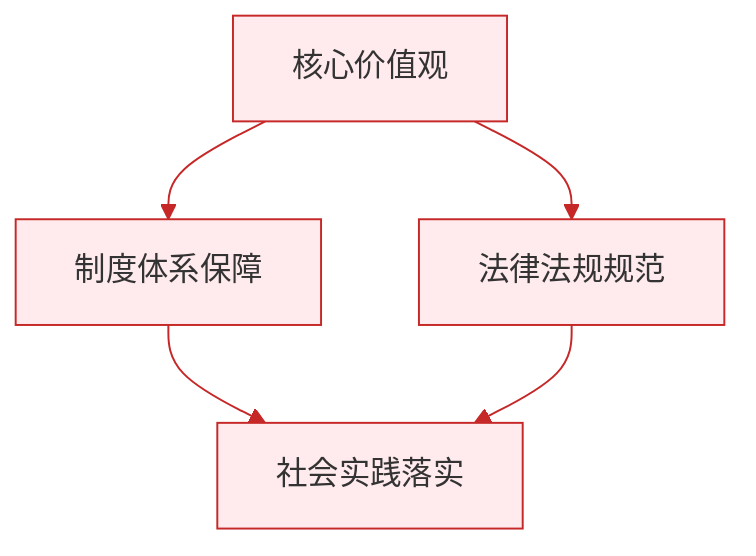

# 历久弥新的思想理念

标签：#中华优秀传统文化 #核心思想理念 #文化传承

## 一、本知识点定位

统编版道德与法治七年级下册 **第三单元 传承中华优秀传统文化 第七课「历久弥新的思想理念」**。本框介绍中华优秀传统文化中的核心思想理念及其当代价值。

## 二、核心观点

1. 中华优秀传统文化蕴含着丰富的**核心思想理念**，是中华民族生生不息、发展壮大的丰厚滋养。
2. 核心思想理念主要包括：**讲仁爱、重民本、守诚信、崇正义、尚和合、求大同**。
3. 这些思想理念**历久弥新**：跨越时空，至今仍具有重要的时代价值。
4. 核心思想理念滋养着中国人的**精神世界**，塑造着中华民族的**价值追求**。
5. 它们为解决当代中国和世界的问题提供了**中国智慧**。

## 三、知识梳理

### 1. 核心思想理念的主要内容（是什么）

- **讲仁爱**："仁者爱人"，关爱他人、推己及人（己所不欲，勿施于人）。
- **重民本**："民为邦本"，重视人民的地位与作用。
- **守诚信**："人而无信，不知其可也"，诚实守信是立身之本。
- **崇正义**："义以为上"，坚守道义、明辨是非。
- **尚和合**："和为贵""和而不同"，崇尚和谐、包容差异。
- **求大同**："天下为公"，追求天下太平、共同美好的社会理想。

### 2. 为什么说历久弥新（为什么）

- 这些理念产生于中华文明的长期发展中，经过历史检验。
- 在今天依然滋养精神、指引实践：如民本思想与以人民为中心的发展思想相通。
- 为构建人类命运共同体等全球议题贡献中国智慧。

### 3. 思想理念与现实的联系

- 讲仁爱 → 尊老爱幼、志愿服务、扶危济困。
- 重民本 → 一切为了人民、脱贫攻坚、民生工程。
- 守诚信 → 社会信用体系、诚信经营。
- 尚和合 → 民族团结、和平外交、邻里和睦。
- 求大同 → 构建人类命运共同体。

## 四、重要概念

| 术语 | 定义 |
|---|---|
| 核心思想理念 | 讲仁爱、重民本、守诚信、崇正义、尚和合、求大同 |
| 民本 | 以民为邦本，重视人民地位与作用的思想 |
| 和而不同 | 崇尚和谐但不强求一致，尊重差异 |
| 大同 | "天下为公"的理想社会追求 |

## 五、案例分析

我国脱贫攻坚战取得全面胜利，近一亿农村贫困人口全部脱贫。这一伟大成就体现了"重民本"的思想理念——把人民利益放在首位；也体现了"讲仁爱""求大同"的价值追求——不让一个人掉队，共同走向美好生活。传统思想理念在新时代焕发出新的生机，指引着国家发展实践。

## 六、背记要点

1. 核心思想理念六个方面：讲仁爱、重民本、守诚信、崇正义、尚和合、求大同。
2. 中华优秀传统文化是中华民族生生不息的丰厚滋养。
3. "己所不欲，勿施于人"体现讲仁爱；"民为邦本"体现重民本。
4. "人而无信，不知其可也"体现守诚信；"天下为公"体现求大同。
5. 核心思想理念历久弥新，至今具有重要时代价值。
6. 为解决当代中国和世界问题提供中国智慧。

## 七、自测小题

1. 中华优秀传统文化的核心思想理念包括讲仁爱、______、守诚信、崇正义、______、求大同。
2. 判断：传统思想理念已经过时，对今天没有意义。（对/错）
3. "己所不欲，勿施于人"体现的理念是（A. 讲仁爱 B. 重民本 C. 求大同）。
4. 简答：为什么说中华优秀传统文化的核心思想理念历久弥新？

**答案**：1. 重民本；尚和合 2. 错（它们跨越时空，至今仍具有重要时代价值） 3. A
4. 答题要点：①核心思想理念在中华文明长期发展中形成，经过历史检验；②至今仍滋养中国人的精神世界，塑造价值追求；③与当代治国理政实践相通（如民本与以人民为中心）；④为解决世界性问题提供中国智慧。

相关：[[做核心思想理念的传承者]] ｜ [[影响深远的人文精神]] ｜ [[薪火相传的传统美德]]

### 政治理论与逻辑框架

