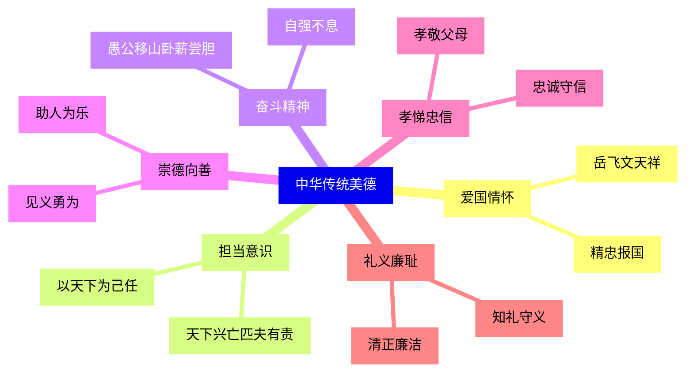

# 薪火相传的传统美德

标签：#传统美德 #道德传承 #民族品格

## 一、本知识点定位

统编版道德与法治七年级下册 **第三单元 传承中华优秀传统文化 第九课「薪火相传的传统美德」**。本框介绍中华传统美德的主要内容及其对民族与个人的重要意义。

## 二、核心观点

1. 中华传统美德是中华文化的**精髓**，是世代相传的**道德结晶**。
2. 主要内容包括：**自强不息的奋斗精神、精忠报国的爱国情怀、天下兴亡匹夫有责的担当意识、崇德向善的社会风尚、孝悌忠信礼义廉耻的荣辱观念**。
3. 传统美德**薪火相传**：融入中华民族的思想观念和行为方式，代代延续。
4. 传统美德是**修身立德**的宝贵资源，是培育社会主义核心价值观的重要源泉。
5. 传统美德具有**生生不息、历久弥新**的品质。

## 三、知识梳理

### 1. 传统美德的主要内容（是什么）

- **爱国**：精忠报国，如岳飞抗金、文天祥"人生自古谁无死，留取丹心照汗青"。
- **担当**："天下兴亡，匹夫有责"，以天下为己任。
- **奋斗**：自强不息，愚公移山、卧薪尝胆。
- **崇德向善**：助人为乐、扶危济困、见义勇为。
- **孝悌忠信**：孝敬父母、友爱兄弟、忠诚守信。
- **礼义廉耻**：知礼守义、清正廉洁、知耻明辱。

### 2. 为什么要传承传统美德（为什么）

- 传统美德是中华民族的精神命脉，塑造了民族品格。
- 是个人修身立德、成长成才的营养剂。
- 是社会和谐、国家发展的道德支撑。
- 是培育和践行社会主义核心价值观的重要源泉。

### 3. 传统美德的时代价值

- 爱国情怀 → 新时代爱国奋斗、科技报国。
- 担当意识 → 抗疫中的最美逆行者。
- 崇德向善 → 道德模范、身边好人评选。
- 诚信美德 → 社会信用体系建设。

## 四、重要概念

| 术语 | 定义 |
|---|---|
| 传统美德 | 中华民族世代相传的优秀道德品质与规范 |
| 精忠报国 | 对祖国竭尽忠诚的爱国情怀 |
| 匹夫有责 | 普通人也对国家兴亡负有责任的担当意识 |
| 崇德向善 | 尊崇道德、追求善行的社会风尚 |

## 五、案例分析

"七一勋章"获得者张桂梅扎根云南山区教育四十余年，创办免费女子高中，帮助两千多名山区女孩走进大学。她身患重病仍坚守讲台。张桂梅身上体现了自强不息的奋斗精神、崇德向善的仁爱之心和"匹夫有责"的担当意识，是中华传统美德在当代的生动写照，激励我们见贤思齐。

## 六、背记要点

1. 中华传统美德是中华文化的精髓。
2. 主要内容：奋斗精神、爱国情怀、担当意识、崇德向善、孝悌忠信、礼义廉耻。
3. "天下兴亡，匹夫有责"——担当；"精忠报国"——爱国。
4. 传统美德是修身立德的宝贵资源。
5. 传统美德是培育社会主义核心价值观的重要源泉。
6. 传统美德生生不息、历久弥新，需要代代传承。

## 七、自测小题

1. "天下兴亡，匹夫有责"体现的传统美德是______意识。
2. 判断：传统美德是古人的事，与当代生活无关。（对/错）
3. "人生自古谁无死，留取丹心照汗青"体现的是（A. 爱国情怀 B. 节俭美德 C. 谦虚礼让）。
4. 简答：为什么要传承中华传统美德？

**答案**：1. 担当 2. 错（传统美德历久弥新，仍是当代道德建设的重要资源） 3. A
4. 答题要点：①传统美德是中华文化精髓、民族精神命脉；②是个人修身立德的营养剂；③是社会和谐与国家发展的道德支撑；④是培育社会主义核心价值观的重要源泉。

相关：[[做中华传统美德的践行者]] ｜ [[历久弥新的思想理念]] ｜ [[做自强不息的中国人]]
