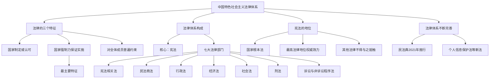

# 日益完善的法律体系

标签：#法律体系 #中国特色社会主义法律体系 #宪法

## 一、本知识点定位

统编版道德与法治七年级下册 **第四单元 生活在法治社会 第十课「日益完善的法律体系」**。本框介绍法律的特征、中国特色社会主义法律体系的构成及其不断完善的进程。

## 二、核心观点

1. 法律是由**国家制定或认可**、靠**国家强制力保证实施**、对**全体社会成员具有普遍约束力**的行为规范。
2. 我国已形成以**宪法**为核心的**中国特色社会主义法律体系**。
3. **宪法是国家的根本法**，具有最高的法律地位、法律权威和法律效力。
4. 法律体系包括宪法及宪法相关法、民法商法、行政法、经济法、社会法、刑法、诉讼与非诉讼程序法等**法律部门**。
5. 随着社会发展，法律体系**不断完善**，立法工作与时俱进（如民法典的编纂、个人信息保护法的出台）。

## 三、知识梳理

### 1. 法律的特征（是什么）

- 法律由国家制定或认可（区别于道德、校规）。
- 法律由国家强制力（军队、警察、法庭、监狱等）保证实施——最主要特征。
- 法律对全体社会成员具有普遍约束力，任何人都没有超越法律的特权。

### 2. 中国特色社会主义法律体系的构成

- 核心：宪法。
- 层次：法律、行政法规、地方性法规等。
- 主要法律部门：宪法相关法、民法商法、行政法、经济法、社会法、刑法、诉讼与非诉讼程序法。

### 3. 宪法的地位（重点）

- 宪法是国家的根本法，是治国安邦的总章程。
- 宪法规定国家生活中最根本、最重要的问题。
- 其他法律依据宪法制定，不得与宪法相抵触。

### 4. 法律体系为什么要不断完善（为什么）

- 社会生活不断发展，出现新领域、新问题（如网络、数据、人工智能）。
- 良法是善治的前提，完善的法律体系是全面依法治国的基础。
- 例：2020年颁布民法典；制定个人信息保护法、家庭教育促进法等。

## 四、法律条文链接

- 《中华人民共和国宪法》序言：本宪法……是国家的根本法，具有最高的法律效力。
- 《中华人民共和国立法法》规定：宪法具有最高的法律效力，一切法律、行政法规、地方性法规……都不得同宪法相抵触。

## 五、案例分析

近年来网络个人信息泄露问题突出，2021年我国出台《中华人民共和国个人信息保护法》，明确处理个人信息应遵循合法、正当、必要原则。这说明：社会生活出现新问题，法律及时回应、填补空白；我国法律体系随时代发展而日益完善，为人民权益提供更全面的保障。

## 六、背记要点

1. 法律三特征：国家制定或认可、国家强制力保证实施（最主要）、对全体成员普遍约束。
2. 我国形成了以宪法为核心的中国特色社会主义法律体系。
3. 宪法是根本法，具有最高法律地位、权威和效力。
4. 七大法律部门：宪法相关法、民法商法、行政法、经济法、社会法、刑法、程序法。
5. 法律体系随社会发展不断完善，良法是善治的前提。

## 七、自测小题

1. 法律最主要的特征是由______保证实施。
2. 判断：宪法与普通法律的地位是一样的。（对/错）
3. 我国法律体系的核心是（A. 民法典 B. 宪法 C. 刑法）。
4. 简答：法律区别于道德等其他行为规范的特征有哪些？

**答案**：1. 国家强制力 2. 错（宪法是根本法，具有最高法律地位、权威和效力） 3. B
4. 答题要点：①法律由国家制定或认可；②法律由国家强制力保证实施，这是法律区别于其他行为规范的最主要特征；③法律对全体社会成员具有普遍约束力。

相关：[[法律保障生活]] ｜ [[认识民法典]] ｜ [[法不可违]]
