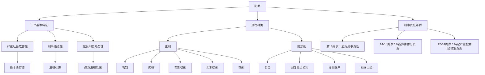

# 犯罪与刑罚

标签：#犯罪 #刑罚 #刑法 #刑事责任

## 一、本知识点定位

统编版道德与法治七年级下册 **第四单元 生活在法治社会 第十二课「犯罪与刑罚」**。本框介绍犯罪的基本特征和刑罚的种类，帮助我们认清犯罪的危害，远离犯罪。

## 二、核心观点

1. **刑法**是惩治犯罪、保护国家和人民利益的有力武器，明确规定了什么行为是犯罪以及应受何种刑罚。
2. **犯罪**是具有严重社会危害性、触犯刑法、应当受到刑罚处罚的行为。
3. 犯罪的三个基本特征：**严重社会危害性（最本质特征）、刑事违法性（法律标志）、应受刑罚处罚性（必然法律后果）**。
4. **刑罚**分为**主刑**和**附加刑**两大类。
5. 任何人犯罪都应受到法律制裁；未成年人犯罪同样要依法承担相应的**刑事责任**。

## 三、知识梳理

### 1. 犯罪的三个基本特征（重点）

- 严重社会危害性：犯罪的最本质特征（区别于一般违法的关键）。
- 刑事违法性：犯罪的法律标志，触犯了刑法。
- 应受刑罚处罚性：犯罪的严重社会危害性和刑事违法性的必然法律后果。
- 三者相互联系、不可分割。

### 2. 刑罚的种类（重点）

- **主刑**（只能独立适用，一罪只能一个主刑）：管制、拘役、有期徒刑、无期徒刑、死刑。
- **附加刑**（可附加适用，也可独立适用）：罚金、剥夺政治权利、没收财产、驱逐出境（适用于外国人）。

### 3. 刑事责任年龄（链接）

- 已满16周岁犯罪，应当负刑事责任。
- 已满14不满16周岁，犯故意杀人、故意伤害致人重伤或死亡、强奸、抢劫、贩卖毒品、放火、爆炸、投放危险物质罪的，应当负刑事责任。
- 已满12不满14周岁，犯故意杀人、故意伤害罪致人死亡或以特别残忍手段致人重伤造成严重残疾，情节恶劣，经最高人民检察院核准追诉的，应当负刑事责任。

### 4. 认清犯罪危害，远离犯罪

- 犯罪对个人：失去自由、断送前途；对家庭：带来痛苦；对社会：破坏秩序。
- 年龄小不是"护身符"，法律对未成年人严重犯罪同样追责。

## 四、法律条文链接

- 《中华人民共和国刑法》第十三条：一切危害国家主权……以及其他危害社会的行为，依照法律应当受刑罚处罚的，都是犯罪。
- 刑法第三十二条：刑罚分为主刑和附加刑。
- 刑法第十七条：已满十六周岁的人犯罪，应当负刑事责任。

## 五、案例分析

17岁的小华长期混迹网吧，先是小偷小摸被治安处罚，后来伙同他人持刀抢劫，被法院以抢劫罪判处有期徒刑并处罚金。本案中，抢劫行为具有严重社会危害性、触犯刑法、受到刑罚处罚，符合犯罪三特征；有期徒刑是主刑，罚金是附加刑。小华从一般违法滑向犯罪的过程警示我们：勿以恶小而为之，要防微杜渐。

## 六、背记要点

1. 刑法是惩治犯罪、保护国家和人民利益的有力武器。
2. 犯罪三特征：严重社会危害性（最本质）、刑事违法性（法律标志）、应受刑罚处罚性（必然后果）。
3. 主刑五种：管制、拘役、有期徒刑、无期徒刑、死刑。
4. 附加刑：罚金、剥夺政治权利、没收财产、驱逐出境。
5. 已满16周岁犯罪应负刑事责任；12-14周岁特定严重犯罪经核准也要追责。
6. 远离犯罪：防微杜渐，勿以恶小而为之。

## 七、自测小题

1. 犯罪的最本质特征是______。
2. 判断：未成年人犯罪一律不负刑事责任。（对/错）
3. 下列属于附加刑的是（A. 拘役 B. 管制 C. 罚金）。
4. 简答：犯罪的三个基本特征及其关系是什么？

**答案**：1. 严重社会危害性 2. 错（已满16周岁犯罪应负刑事责任，14-16、12-14周岁犯特定严重罪行也要依法追责） 3. C
4. 答题要点：①严重社会危害性——最本质特征；②刑事违法性——法律标志；③应受刑罚处罚性——必然法律后果。三者相互联系、不可分割，是区分罪与非罪的标准。

相关：[[法不可违]] ｜ [[严于律己]] ｜ [[日益完善的法律体系]]
