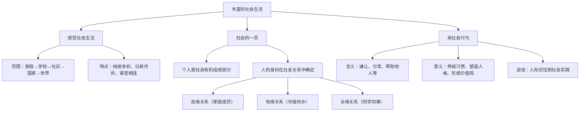

# 第一课 丰富的社会生活

## 核心概念

社会生活是由人们在社会交往中形成的各种关系与活动构成的复杂系统。个人是社会的有机组成部分，人的身份是在社会关系中确定的。我们可以从家庭、学校、社区、网络等多个维度感受社会生活的绚丽多彩，并在参与社会生活的过程中不断成长。

## 知识框架

### 一、感受社会生活

1. 社会生活的范围
   - 从家庭走向学校、社区、国家与世界。
   - 随着身体的成长、智力的发展、能力的提高，社会生活空间不断延展。
2. 社会生活的特点
   - 绚丽多彩：社会生活内容丰富、形式多样。
   - 日新月异：社会不断发展变化，新现象、新事物层出不穷。
   - 紧密相连：个人与社会、个人与他人相互联系、相互影响。

### 二、我们都是社会的一员

1. 个人是社会的有机组成部分
   - 每个人都是社会这张"大网"上的一个"结点"。
   - 个人离不开社会，社会也离不开个人。
2. 人的身份是在社会关系中确定的
   - 血缘关系：如家庭、家族成员之间的关系。
   - 地缘关系：如邻居、同乡之间的关系。
   - 业缘关系：如同学、同事之间的关系。

### 三、亲社会行为

1. 含义：谦让、分享、帮助他人、关心社会发展等行为。
2. 意义
   - 有利于养成良好的行为习惯。
   - 有利于塑造健康的人格。
   - 有利于形成正确的价值观念。
   - 有利于获得他人和社会的接纳与认可。
3. 养成途径
   - 在人际交往和社会实践中养成。
   - 主动了解社会、关注社会发展变化、积极投身社会实践。

## 案例分析

**案例**：某中学组织学生走进社区敬老院，为老人表演节目、打扫卫生、聊天谈心。

**分析**：这一活动让学生走出校园，感受社会生活的多样性；通过与老人的互动，培养了亲社会行为；同时体现了个人在社会关系中的多重身份——学生、志愿者、社区成员。此类实践活动有助于学生认识社会、服务社会、健康成长。

## 背记要点

- 个人离不开社会，社会也离不开个人。
- 人的身份是在社会关系中确定的。
- 社会关系主要包括血缘关系、地缘关系、业缘关系。
- 亲社会行为在人际交往和社会实践中养成。
- 要主动了解社会、关注社会发展变化、积极投身社会实践。

## 自测题

1. 人的身份是在什么中确定的？
2. 社会关系主要包括哪三种？请各举一例。
3. 亲社会行为有哪些具体表现？
4. 为什么要养成亲社会行为？
5. 如何在社会实践中培养亲社会行为？

相关知识点：[[第二课 在社会中健康成长]]、[[第三课 共建网络美好家园]]、[[第九课 积极奉献社会]]
